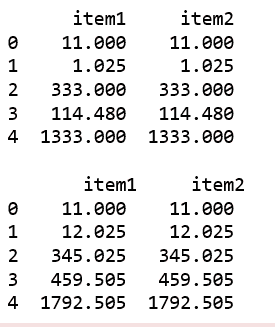
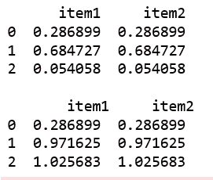

# python | pandas panel . cum sum()

> 原文:[https://www.geeksforgeeks.org/python-pandas-panel-cumsum/](https://www.geeksforgeeks.org/python-pandas-panel-cumsum/)

在熊猫中，面板是一个非常重要的三维数据容器。三个轴的名称旨在为描述涉及面板数据的操作，特别是面板数据的计量经济学分析提供一些语义含义。

`**Panel.cumsum()**`函数用于返回包含累计和的相同大小的数据帧或系列。

> **语法:** Panel.cumsum(轴=无，skipna =真，*args，**kwargs)
> 
> **参数:**
> **轴:**轴的索引或名称。0 相当于“无”或“索引”。
> **skipna :** 排除 NA/null 值。如果整行/整列为“无”，结果将为“无”。
> 
> **返回:**数据框或面板的总和

**代码#1:**

```py
# importing pandas module 
import pandas as pd 
import numpy as np

df1 = pd.DataFrame({'a': ['Geeks', 'For', 'geeks', 'for', 'real'], 
                    'b': [11, 1.025, 333, 114.48, 1333]})

data = {'item1':df1, 'item2':df1}

# creating Panel 
panel = pd.Panel.from_dict(data, orient ='minor')

print(panel['b'])

print("\n", panel['b'].cumsum(axis = 0))
```

**输出:**


**代码#2:**

```py
# importing pandas module 
import pandas as pd 
import numpy as np

df1 = pd.DataFrame({'a': ['Geeks', 'For', 'geeks'], 
                    'b': np.random.randn(3)})

data = {'item1':df1, 'item2':df1}

# creating Panel 
panel = pd.Panel.from_dict(data, orient ='minor')

print(panel['b'])

print("\n", panel['b'].cumsum(axis = 0))
```

**输出:**
