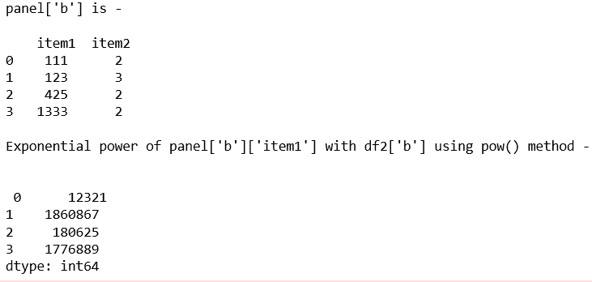

# Python | Pandas Panel.pow()

> 原文:[https://www.geeksforgeeks.org/python-pandas-panel-pow/](https://www.geeksforgeeks.org/python-pandas-panel-pow/)

在熊猫中，面板是一个非常重要的三维数据容器。三个轴的名称旨在为描述涉及面板数据的操作，特别是面板数据的计量经济学分析提供一些语义含义。

熊猫 **`Panel.pow()`** 函数用于获得数列和数据框/面板的指数幂。

> **语法:** Panel.pow(其他，轴=0)
> 
> **参数:**
> **其他:**数据框或面板
> **轴:**轴广播结束
> 
> **返回:**面板

**代码#1:**

```py
# importing pandas module 
import pandas as pd 
import numpy as np 

df1 = pd.DataFrame({'a': ['Geeks', 'For', 'geeks', 'real'], 
                    'b': [111, 123, 425, 1333]}) 

df2 = pd.DataFrame({'a': ['I', 'am', 'dataframe', 'two'], 
                    'b': [2, 3, 2, 2]}) 

data = {'item1':df1, 'item2':df2}

# creating Panel 
panel = pd.Panel.from_dict(data, orient ='minor') 
print("panel['b'] is - \n\n", panel['b']) 

print("\nExponential power of panel['b']['item1'] with df2['b'] using pow() method - \n") 
print("\n", panel['b']['item1'].pow(df2['b'], axis = 0)) 
```

**输出:**


**代码#2:**

```py
# importing pandas module 
import pandas as pd 
import numpy as np 

df1 = pd.DataFrame({'a': ['Geeks', 'For', 'geeks', 'for', 'real'], 
                    'b': [11, 1.025, 333, 114.48, 1333]}) 

data = {'item1':df1, 'item2':df1} 

# creating Panel 
panel = pd.Panel.from_dict(data, orient ='minor') 
print("panel['b'] is - \n\n", panel['b'], '\n') 

# Create a 5 * 5 dataframe 
df2 = pd.DataFrame(np.random.rand(5, 2), columns =['item1', 'item2']) 
print("Newly create dataframe with random values is - \n\n", df2)

print("\nExponential power of panel['b'] with df2 using pow() method - \n") 
print(panel['b'].pow(df2, axis = 0)) 
```

**输出:**


**代码#3:**

```py
# importing pandas module 
import pandas as pd 
import numpy as np 

df1 = pd.DataFrame({'a': ['Geeks', 'For', 'geeks', 'for', 'real'], 
                    'b': [2, 4, 6, 6, 10]}) 

df2 = pd.DataFrame({'a': ['I', 'am', 'DataFrame', 'number', 'two'], 
                    'b': [10, 5, 3, 6, 7]})                     

data = {'item1':df1, 'item2':df2} 

# creating Panel 
panel = pd.Panel.from_dict(data, orient ='minor') 

print("panel['b'] is - \n\n", panel['b'], '\n') 

print("\nExponential power of panel['b']['item1'] with df2['b'] or panel['b']['item2'] using pow() method - \n") 
print("\n", panel['b']['item1'].pow(df2['b'], axis = 0)) 
```

**输出:**
