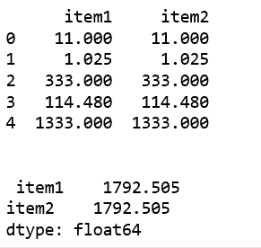
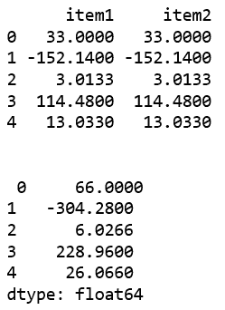
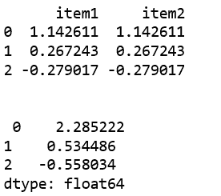

# 蟒蛇|熊猫 pants . sum()

> 原文:[https://www.geeksforgeeks.org/python-pandas-panel-sum/](https://www.geeksforgeeks.org/python-pandas-panel-sum/)

在熊猫中，面板是一个非常重要的三维数据容器。三个轴的名称旨在为描述涉及面板数据的操作，特别是面板数据的计量经济学分析提供一些语义含义。

`**Panel.sum()**`函数用于返回所请求轴的值之和。

> **语法:** Panel.sum(轴=无，skipna =无，级别=无，numeric _ only =无，min_count=0，**kwargs)
> 
> **参数:**
> 轴:{items (0)，长 _ 轴(1)，短 _ 轴(2)}
> skipna:计算结果时排除 NA/null 值。
> 级别:如果轴是多索引，沿特定级别计数，折叠成数据框
> numeric_only:仅包括浮点、int 和布尔列。如果没有，将尝试使用所有内容，然后只使用数字数据。
> min_count:执行操作所需的有效值数量。
> 
> **返回:**数据框或面板

**代码#1:**

```
# importing pandas module 
import pandas as pd 
import numpy as np

df1 = pd.DataFrame({'a': ['Geeks', 'For', 'geeks', 'for', 'real'], 
                    'b': [11, 1.025, 333, 114.48, 1333]})

data = {'item1':df1, 'item2':df1}

# creating Panel 
panel = pd.Panel.from_dict(data, orient ='minor')

print(panel['b'], '\n')

print("\n", panel['b'].sum(axis = 0))
```

**输出:**


**代码#2:**

```
# importing pandas module 
import pandas as pd 
import numpy as np

df1 = pd.DataFrame({'a': ['Geeks', 'For', 'geeks', 'for', 'real'], 
                    'b': [33.0, -152.140, 3.0133, 114.48, 13.033]})

data = {'item1':df1, 'item2':df1}

# creating Panel 
panel = pd.Panel.from_dict(data, orient ='minor')

print(panel['b'], '\n')

print("\n", panel['b'].sum(axis = 1))
```

**输出:**


**代码#3:**

```
# importing pandas module 
import pandas as pd 
import numpy as np

df1 = pd.DataFrame({'a': ['Geeks', 'For', 'geeks'], 
                    'b': np.random.randn(3)})

data = {'item1':df1, 'item2':df1}

# creating Panel 
panel = pd.Panel.from_dict(data, orient ='minor')

print(panel['b'], '\n')

print("\n", panel['b'].sum(axis = 1))
```

**输出:**
