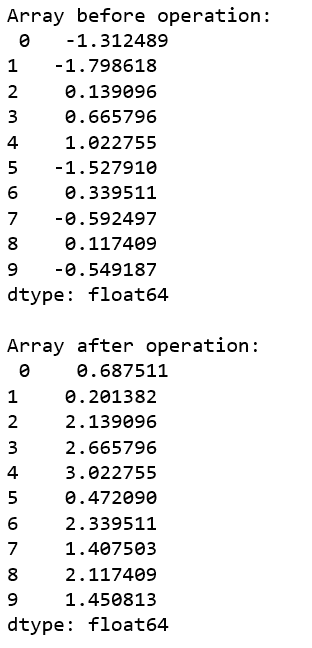

# 蟒蛇|熊猫系列. agg()

> 原文:[https://www.geeksforgeeks.org/python-pandas-series-agg/](https://www.geeksforgeeks.org/python-pandas-series-agg/)

Python 是进行数据分析的优秀语言，主要是因为以数据为中心的 python 包的奇妙生态系统。 ***【熊猫】*** 就是其中一个包，让导入和分析数据变得容易多了。

Pandas `**Series.agg()**`用于传递一个函数或函数列表，分别应用于一个系列甚至系列的每个元素。如果是函数列表，通过`agg()`方法返回多个结果。

> **语法:** Series.agg(func，axis=0)
> 
> **参数:**
> **函数:**函数、函数列表或要在 Series 上调用的函数名字符串。
> **轴:**行操作为 0 或“索引”，列操作为 1 或“列”。
> 
> **返回类型:**返回类型取决于作为参数传递的函数的返回类型。

**示例#1:**
在此示例中，传递了一个 lambda 函数，该函数简单地将每个序列值加 2。由于该函数将应用于系列的每个值，因此返回类型也是系列。通过传递使用 Numpy 随机方法生成的数组，生成由 10 个元素组成的随机序列。

```py
# importing pandas module
import pandas as pd

# importing numpy module
import numpy as np

# creating random arr of 10 elements
arr=np.random.randn(10)

# creating series from array
series=pd.Series(arr)

# calling .agg() method
result=series.agg(lambda num : num + 2) 

# display
print('Array before operation: \n', series,
      '\n\nArray after operation: \n',result)
```

**输出:**

如输出所示，将函数应用于每个值，并将 2 添加到系列的每个值。

**示例#2:** 传递函数列表

在这个例子中，一些 Python 默认函数的列表被传递，多个结果被`agg()`方法返回到多个变量中。

```py
# importing pandas module
import pandas as pd

# importing numpy module
import numpy as np

# creating random arr of 10 elements
arr=np.random.randn(10)

# creating series from array
series=pd.Series(arr)

# creating list of function names
func_list=[min, max, sorted]

# calling .agg() method
# passing list of functions
result1, result2, result3= series.agg(func_list) 

# display
print('Series before operation: \n', series)
print('\nMin = {}\n\nMax = {},\
      \n\nSorted Series:\n{}'.format(result1,result2,result3))
```

**输出:**

如输出所示，返回多个结果。最小值、最大值和排序数组分别返回到不同的变量 result1、result2 和 result3 中。