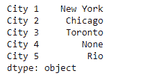
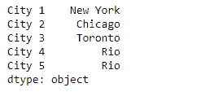
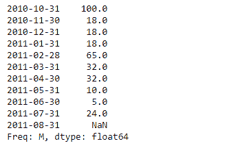

# 蟒蛇|熊猫系列. bfill()

> 原文:[https://www.geeksforgeeks.org/python-pandas-series-bfill/](https://www.geeksforgeeks.org/python-pandas-series-bfill/)

熊猫系列是带有轴标签的一维数组。标签不必是唯一的，但必须是可散列的类型。该对象支持基于整数和基于标签的索引，并提供了一系列方法来执行涉及索引的操作。

熊猫 `**Series.bfill()**`功能是倒填法的代名词。该函数用于填充给定序列对象中缺失的值。

> **语法:** Series.bfill(轴=无，在位=假，极限=无，向下转换=无)
> 
> **参数:**
> **轴:**轴= 1
> **在位:**对同一对象进行更改
> **限制:**要填充的连续缺失值的最大数量
> 
> **返回:**系列

**示例#1:** 使用`Series.bfill()`函数填充给定序列对象中缺失的值。

```
# importing pandas as pd
import pandas as pd

# Creating the Series
sr = pd.Series(['New York', 'Chicago', 'Toronto', None, 'Rio'])

# Create the Index
index_ = ['City 1', 'City 2', 'City 3', 'City 4', 'City 5'] 

# set the index
sr.index = index_

# Print the series
print(sr)
```

**输出:**


现在我们将使用`Series.bfill()`函数来填充给定序列对象中缺失的值。

```
# fill the missing values using backward fill method
result = sr.bfill()

# Print the result
print(result)
```

**输出:**

正如我们在输出中看到的，`Series.bfill()`函数已经使用向后填充方法成功填充了给定序列对象中缺失的值。

**例 2 :** 使用`Series.bfill()`函数填充给定序列对象中缺失的值。

```
# importing pandas as pd
import pandas as pd

# Creating the Series
sr = pd.Series([100, None, None, 18, 65, None, 32, 10, 5, 24, None])

# Create the Index
index_ = pd.date_range('2010-10-09', periods = 11, freq ='M')

# set the index
sr.index = index_

# Print the series
print(sr)
```

**输出:**

现在我们将使用`Series.bfill()`函数来填充给定序列对象中缺失的值。

```
# fill the missing values using backward fill method
result = sr.bfill()

# Print the result
print(result)
```

**输出:**

正如我们在输出中所看到的，`Series.bfill()`函数已经使用向后填充方法成功地填充了给定序列对象中缺失的值。请注意，最后一个值尚未填充，因为该元素之后的序列中没有有效值。