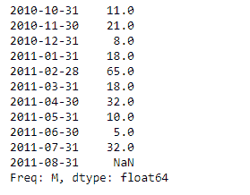

# 蟒蛇|熊猫系列. corr()

> 原文:[https://www.geeksforgeeks.org/python-pandas-series-corr/](https://www.geeksforgeeks.org/python-pandas-series-corr/)

熊猫系列是带有轴标签的一维数组。标签不必是唯一的，但必须是可散列的类型。该对象支持基于整数和基于标签的索引，并提供了一系列方法来执行涉及索引的操作。

熊猫 `**Series.corr()**`函数计算与其他系列的相关性，排除缺失值。

> **语法:** Series.corr(other，method='pearson '，min_periods=None)
> 
> **参数:**
> **其他:**系列
> **方法:** { '皮尔逊'，'肯德尔'，'斯皮尔曼' }或可调用的
> **min_periods :** 获得有效结果所需的最小观察次数
> 
> **返回:**相关:浮动

**示例#1:** 使用`Series.corr()`函数找到给定系列对象与其他对象的相关性。

```py
# importing pandas as pd
import pandas as pd

# Creating the first Series
sr1 = pd.Series([80, 25, 3, 25, 24, 6])

# Creating the second Series
sr2 = pd.Series([34, 5, 13, 32, 4, 15])

# Create the Index
index_ = ['Coca Cola', 'Sprite', 'Coke', 'Fanta', 'Dew', 'ThumbsUp']

# set the first index
sr1.index = index_

# set the second index
sr2.index = index_

# Print the first series
print(sr1)

# Print the second series
print(sr2)
```

**输出:**


现在我们将使用`Series.corr()`函数来查找给定序列对象的底层数据与其他数据之间的相关性。

```py
# find the correlation
result = sr1.corr(sr2)

# Print the result
print(result)
```

**输出:**

正如我们在输出中看到的，`Series.corr()`函数已经成功地返回了给定序列对象的底层数据之间的相关性。

**例 2 :** 使用`Series.corr()`函数找出给定序列对象与其他序列对象的相关性。系列对象包含一些缺失的值。

```py
# importing pandas as pd
import pandas as pd

# Creating the first Series
sr1 = pd.Series([51, 10, 24, 18, None, 84, 12, 10, 5, 24, 2])

# Creating the second Series
sr2 = pd.Series([11, 21, 8, 18, 65, 18, 32, 10, 5, 32, None])

# Create the Index
index_ = pd.date_range('2010-10-09', periods = 11, freq ='M')

# set the first index
sr1.index = index_

# set the second index
sr2.index = index_

# Print the first series
print(sr1)

# Print the second series
print(sr2)
```

**输出:**



现在我们将使用`Series.corr()`函数来查找给定序列对象的底层数据与其他数据之间的相关性。

```py
# find the correlation
result = sr1.corr(sr2)

# Print the result
print(result)
```

**输出:**

正如我们在输出中看到的，`Series.corr()`函数已经成功返回了给定序列对象的底层数据之间的相关性。在计算对象之间的相关性时，会跳过缺少的值。