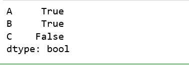

# Python |熊猫系列/Dataframe.any()

> 原文:[https://www . geesforgeks . org/python-pandas-series-data frame-any/](https://www.geeksforgeeks.org/python-pandas-series-dataframe-any/)

Python 是进行数据分析的优秀语言，主要是因为以数据为中心的 python 包的奇妙生态系统。 ***【熊猫】*** 就是其中一个包，让导入和分析数据变得容易多了。

熊猫 **`any()`** 方法适用于*系列*和*数据框*。它检查调用者对象(数据帧或系列)中的任何值是否不为 0，并为此返回真。如果所有值都为 0，它将返回 False。

> **语法:** DataFrame.any(axis=0，bool _ only =无，skipna =真，level =无，**kwargs)
> 
> **参数:**
> **轴:** 0 或‘索引’按行应用方法，1 或‘列’按列应用方法。
> **bool_only:** 在数据框中检查 bool only 系列，如果没有找到，将只使用布尔值。此参数不适用于系列，因为只有一列。
> **skipna:** 布尔值，如果为假，则为整个 NaN 列/行返回真
> **级别:** int 或 str，指定多级情况下的级别
> 
> **返回类型:**布尔级数

**示例#1:** 索引方式实现

在本例中，通过将字典传递给 Pandas `DataFrame()`方法创建了一个示例数据框。使用 Numpy `np.nan`将空值传递给一些索引，以检查空值的行为。因为在本例中，方法是在索引上实现的，所以 axis 参数保持为 0(代表行)。

```py
# importing pandas module 
import pandas as pd 

# importing numpy module
import numpy as np

# creating dictionary
dic = {'A': [1, 2, 3, 4, 0, np.nan, 3],
       'B': [3, 1, 4, 5, 0, np.nan, 5],
       'C': [0, 0, 0, 0, 0, 0, 0]}

# making dataframe using dictionary
data = pd.DataFrame(dic)

# calling data.any column wise
result = data.any(axis = 0)

# displaying result
result
```

**输出:**
如输出所示，由于最后一列的所有值都等于零，因此只为该列返回 False。


**示例#2:** 列式实现

在本例中，通过将字典传递给 Pandas `DataFrame()`方法创建了一个样本数据框，就像上面的例子一样。但是，不是将 0 传递给 axis 参数，而是将 1 传递给每个列中的每个值。

```py
# importing pandas module 
import pandas as pd 

# importing numpy module
import numpy as np

# creating dictionary
dic = {'A': [1, 2, 3, 4, 0, np.nan, 3],
       'B': [3, 1, 4, 5, 0, np.nan, 5],
       'C': [0, 0, 0, 0, 0, 0, 0]}

# making dataframe using dictionary
data = pd.DataFrame(dic)

# calling data.any column wise
result = data.any(axis = 1)

# displaying result
result
```

**输出:**
如输出所示，仅对于所有值都为 0 或 NaN 和 0 的行返回 False。
