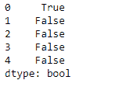
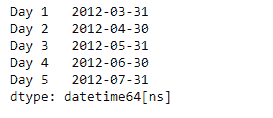
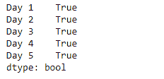

# Python | Pandas series . dt . is _ month _ end

> 原文:[https://www . geesforgeks . org/python-pandas-series-dt-is _ month _ end/](https://www.geeksforgeeks.org/python-pandas-series-dt-is_month_end/)

`Series.dt`可用于访问系列的值，如 datetimelike，并返回几个属性。熊猫 `**Series.dt.is_month_end**`属性返回一个布尔值，指示日期是否是一个月的最后一天。

> **语法:** Series.dt.is_month_end
> 
> **参数:**无
> 
> **返回:** numpy 数组

**示例#1:** 使用`Series.dt.is_month_end`属性检查给定序列对象的基础数据中的日期是否是当月的最后一天。

```py
# importing pandas as pd
import pandas as pd

# Creating the Series
sr = pd.Series(['2012-1-31', '2019-7-18 12:30', '2008-02-2 10:30',
               '2010-4-22 09:25', '2019-1-1 00:00'])

# Creating the index
idx = ['Day 1', 'Day 2', 'Day 3', 'Day 4', 'Day 5']

# set the index
sr.index = idx

# Convert the underlying data to datetime 
sr = pd.to_datetime(sr)

# Print the series
print(sr)
```

**输出:**


现在我们将使用`Series.dt.is_month_end`属性来检查给定序列对象中的日期是否是一个月的最后一天。

```py
# check if dates are the last
# day of the month or not
result = sr.dt.is_month_end

# print the result
print(result)
```

**输出:**

正如我们在输出中看到的，`Series.dt.is_month_end`属性已经成功访问并返回了指示日期是否是一个月的最后一天的布尔值。

**例 2 :** 使用`Series.dt.is_month_end`属性检查给定序列对象的基础数据中的日期是否为当月的最后一天。

```py
# importing pandas as pd
import pandas as pd

# Creating the Series
sr = pd.Series(pd.date_range('2012-3-31 00:00', 
                      periods = 5, freq = 'M'))

# Creating the index
idx = ['Day 1', 'Day 2', 'Day 3', 'Day 4', 'Day 5']

# set the index
sr.index = idx

# Print the series
print(sr)
```

**输出:**


现在我们将使用`Series.dt.is_month_end`属性来检查给定序列对象中的日期是否是一个月的最后一天。

```py
# check if dates are the last
# day of the month or not
result = sr.dt.is_month_end

# print the result
print(result)
```

**输出:**

正如我们在输出中看到的，`Series.dt.is_month_end`属性已经成功访问并返回了指示日期是否是一个月的最后一天的布尔值。