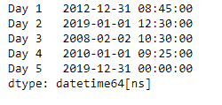
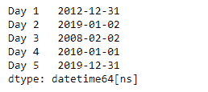

# 蟒蛇|熊猫系列. dt.round

> 原文:[https://www . geesforgeks . org/python-pandas-series-dt-round/](https://www.geeksforgeeks.org/python-pandas-series-dt-round/)

`Series.dt`可用于访问系列的值，如 datetimelike，并返回几个属性。熊猫 `**Series.dt.round()**`功能对数据执行舍入运算，达到指定频率。

> **语法:** Series.dt.round(*args，**kwargs)
> 
> **参数:**
> **频率:**将频率级别四舍五入到指数
> 
> **返回:**日期时间索引、时间增量索引或序列

**示例#1:** 使用`Series.dt.round()`函数将给定序列对象的日期时间数据舍入到指定的频率。

```
# importing pandas as pd
import pandas as pd

# Creating the Series
sr = pd.Series(['2012-12-31 08:45', '2019-1-1 12:30', '2008-02-2 10:30',
               '2010-1-1 09:25', '2019-12-31 00:00'])

# Creating the index
idx = ['Day 1', 'Day 2', 'Day 3', 'Day 4', 'Day 5']

# set the index
sr.index = idx

# Convert the underlying data to datetime 
sr = pd.to_datetime(sr)

# Print the series
print(sr)
```

**输出:**



现在我们将使用`Series.dt.round()`函数将给定序列对象中的日期时间值舍入到每日频率。

```
# round to daily frequency
result = sr.dt.round(freq = 'D')

# print the result
print(result)
```

**输出:**



正如我们在输出中看到的那样，`Series.dt.round()`函数已经成功地将给定序列对象中的日期时间值舍入到指定的频率。

**示例#2 :** 使用`Series.dt.round()`函数将给定序列对象的日期时间数据舍入到指定的频率。

```
# importing pandas as pd
import pandas as pd

# Creating the Series
sr = pd.Series(pd.date_range('2012-12-31 09:45', periods = 5, freq = 'T',
                            tz = 'Asia / Calcutta'))

# Creating the index
idx = ['Day 1', 'Day 2', 'Day 3', 'Day 4', 'Day 5']

# set the index
sr.index = idx

# Print the series
print(sr)
```

**输出:**


现在我们将使用`Series.dt.round()`函数将给定序列对象中的日期时间值舍入到每小时频率。

```
# round to hourly frequency
result = sr.dt.round(freq = 'H')

# print the result
print(result)
```

**输出:**


正如我们在输出中看到的那样，`Series.dt.round()`函数已经成功地将给定序列对象中的日期时间值舍入到指定的频率。