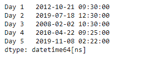
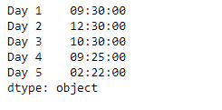
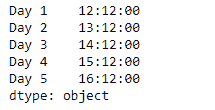

# 蟒蛇|熊猫系列. dt.time

> 原文:[https://www.geeksforgeeks.org/python-pandas-series-dt-time/](https://www.geeksforgeeks.org/python-pandas-series-dt-time/)

`Series.dt`可用于访问系列的值，如 datetimelike，并返回几个属性。Pandas `**Series.dt.time**`属性返回 python datetime.time 对象的 numpy 数组。

> **语法:** Series.dt.time
> 
> **参数:**无
> 
> **返回:** numpy 数组

**示例#1:** 使用`Series.dt.time`属性返回给定 Series 对象的基础数据的时间属性。

```
# importing pandas as pd
import pandas as pd

# Creating the Series
sr = pd.Series(['2012-10-21 09:30', '2019-7-18 12:30', '2008-02-2 10:30',
                '2010-4-22 09:25', '2019-11-8 02:22'])

# Creating the index
idx = ['Day 1', 'Day 2', 'Day 3', 'Day 4', 'Day 5']

# set the index
sr.index = idx

# Convert the underlying data to datetime 
sr = pd.to_datetime(sr)

# Print the series
print(sr)
```

**输出:**


现在我们将使用`Series.dt.time`属性返回给定 Series 对象的底层数据的时间属性。

```
# return the time
result = sr.dt.time

# print the result
print(result)
```

**输出:**

正如我们在输出中看到的，`Series.dt.time`属性已经成功访问并返回了给定序列对象中底层数据的时间属性。

**例 2 :** 使用`Series.dt.time`属性返回给定 Series 对象底层数据的时间属性。

```
# importing pandas as pd
import pandas as pd

# Creating the Series
sr = pd.Series(pd.date_range('2012-12-12 12:12',
                       periods = 5, freq = 'H'))

# Creating the index
idx = ['Day 1', 'Day 2', 'Day 3', 'Day 4', 'Day 5']

# set the index
sr.index = idx

# Print the series
print(sr)
```

**输出:**


现在我们将使用`Series.dt.time`属性返回给定 Series 对象的底层数据的时间属性。

```
# return the time
result = sr.dt.time

# print the result
print(result)
```

**输出:**

正如我们在输出中看到的，`Series.dt.time`属性已经成功访问并返回了给定序列对象中底层数据的 time 属性。