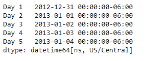
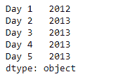

# 蟒蛇|熊猫系列. dt.to_period

> 原文:[https://www . geesforgeks . org/python-pandas-series-dt-to _ period/](https://www.geeksforgeeks.org/python-pandas-series-dt-to_period/)

`Series.dt`可用于访问系列的值，如 datetimelike，并返回几个属性。熊猫 `**Series.dt.to_period()**`函数以特定的频率将给定序列对象的底层数据转换为周期数组/索引。

> **语法:** Series.dt.to_period(*args，**kwargs)
> 
> **参数:**
> 
> **频率:**字符串或偏移量，可选
> 
> **返回:**周期数组/索引

**示例#1:** 使用`Series.dt.to_period()`函数将给定序列对象的基础数据以每周频率转换为索引。

```
# importing pandas as pd
import pandas as pd

# Creating the Series
sr = pd.Series(['2012-12-31', '2019-1-1 12:30', '2008-02-2 10:30',
               '2010-1-1 09:25', '2019-12-31 00:00'])

# Creating the index
idx = ['Day 1', 'Day 2', 'Day 3', 'Day 4', 'Day 5']

# set the index
sr.index = idx

# Convert the underlying data to datetime 
sr = pd.to_datetime(sr)

# Print the series
print(sr)
```

**输出:**


现在我们将使用`Series.dt.to_period()`函数将给定序列对象的底层数据以每周频率转换为索引。

```
# cast to targert frequency
result = sr.dt.to_period(freq = 'W') 

# print the result
print(result)
```

**输出:**


正如我们在输出中看到的，`Series.dt.to_period()`函数已经成功地将数据转换到目标频率。

**示例 2 :** 使用`Series.dt.to_period()`函数将给定序列对象的基础数据以两年为一个频率转换为 Index。

```
# importing pandas as pd
import pandas as pd

# Creating the Series
sr = pd.Series(pd.date_range('2012-12-31 00:00', periods = 5, freq = 'D',
                            tz = 'US / Central'))

# Creating the index
idx = ['Day 1', 'Day 2', 'Day 3', 'Day 4', 'Day 5']

# set the index
sr.index = idx

# Print the series
print(sr)
```

**输出:**



现在我们将使用`Series.dt.to_period()`函数将给定序列对象的底层数据以两年的频率转换为 Index。

```
# cast to targert frequency
result = sr.dt.to_period(freq = '2Y') 

# print the result
print(result)
```

**输出:**



正如我们在输出中看到的，`Series.dt.to_period()`函数已经成功地将数据转换到目标频率。