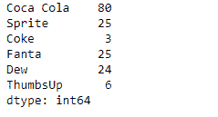
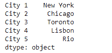

# Python | Pandas series . filter()

> 原文:[https://www.geeksforgeeks.org/python-pandas-series-filter/](https://www.geeksforgeeks.org/python-pandas-series-filter/)

熊猫系列是带有轴标签的一维数组。标签不必是唯一的，但必须是可散列的类型。该对象支持基于整数和基于标签的索引，并提供了一系列方法来执行涉及索引的操作。

熊猫 `**Series.filter()**`函数根据指定索引中的标签返回数据帧的子集行或列。请注意，该例程不会对数据帧的内容进行过滤。筛选器应用于索引的标签。

> **语法:**series . filter(items =无，like =无，regex =无，axis =无)
> 
> **参数:**
> **项目:**要限制的轴列表(不能全部存在)。
> **像:**保持轴在“arg in col == True”的位置。
> **正则表达式:**用 re.search 保持坐标轴(正则表达式，col)= True。
> **轴:**要过滤的轴。默认情况下，这是信息轴，“系列”的“索引”，数据框的“列”。
> 
> **返回:**与输入对象类型相同

**示例#1:** 使用`Series.filter()`函数使用正则表达式过滤掉给定序列对象中的一些值。

```
# importing pandas as pd
import pandas as pd

# Creating the Series
sr = pd.Series([80, 25, 3, 25, 24, 6])

# Create the Index
index_ = ['Coca Cola', 'Sprite', 'Coke', 'Fanta', 'Dew', 'ThumbsUp']

# set the index
sr.index = index_

# Print the series
print(sr)
```

**输出:**


现在我们将使用`Series.filter()`函数从给定的序列对象中过滤那些值，该序列对象的索引标签名称中有一个空格。

```
# filter values
result = sr.filter(regex = '. .')

# Print the result
print(result)
```

**输出:**

正如我们在输出中看到的，`Series.filter()`函数已经成功地从给定的序列对象中返回了所需的值。

**示例 2 :** 使用`Series.filter()`函数，使用索引标签列表过滤出给定序列对象中的一些值。

```
# importing pandas as pd
import pandas as pd

# Creating the Series
sr = pd.Series(['New York', 'Chicago', 'Toronto', 'Lisbon', 'Rio'])

# Create the Index
index_ = ['City 1', 'City 2', 'City 3', 'City 4', 'City 5'] 

# set the index
sr.index = index_

# Print the series
print(sr)
```

**输出:**

现在我们使用`Series.filter()`函数过滤给定序列对象中传递的索引标签对应的值。

```
# filter values
result = sr.filter(items = ['City 2', 'City 4'])

# Print the result
print(result)
```

**输出:**

正如我们在输出中看到的，`Series.filter()`函数已经成功地从给定的序列对象中返回了所需的值。