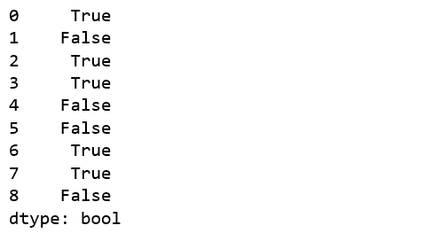
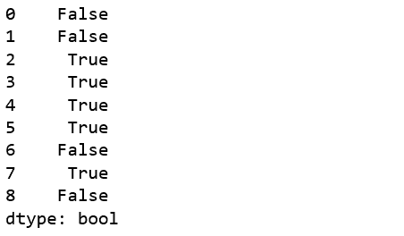

# 蟒蛇|熊猫系列. ge()

> 原文:[https://www.geeksforgeeks.org/python-pandas-series-ge/](https://www.geeksforgeeks.org/python-pandas-series-ge/)

Python 是进行数据分析的优秀语言，主要是因为以数据为中心的 Python 包的奇妙生态系统。 ***【熊猫】*** 就是其中一个包，让导入和分析数据变得容易多了。

Pandas `series.ge()`用于将 Caller 系列的每个元素与传递的系列进行比较。对于大于或等于传递序列中元素的每个元素，它都返回真。

**注意:**结果是在比较主叫**系列> =其他系列的基础上返回的。**

> **语法:** Series.ge(其他，级别=无，fill _ value =无，轴=0)
> 
> **参数:**
> **其他:**要与
> **进行比较的其他系列级别:**多级别情况下的 int 或级别名称
> **fill_value:** 要替换的值而不是 NaN
> **轴:** 0 或“index”按行应用方法，1 或“columns”按列应用方法。
> 
> **返回类型:**布尔级数

**示例#1:** NaN 处理

在本例中，使用`pd.Series()`创建了两个系列。该系列在相同的索引中包含一些空值和一些相等的值。使用`.ge()` 方法比较系列，并将 7 传递给 fill_value 参数，用 7 替换 NaN 值。

```
# importing pandas module  
import pandas as pd  

# importing numpy module 
import numpy as np 

# creating series 1 
series1 = pd.Series([70, 0, 2, 225, 1, 16, np.nan, 10, np.nan]) 

# creating series 2 
series2 = pd.Series([27, np.nan, 2, 23, 5, 95, 4, 3, 19]) 

# NaN replacement
replace_nan = 7

# calling and returning to result variable
result = series1.ge(series2, fill_value = replace_nan)

# display 
result 
```

**输出:**
如输出所示，只要调用者序列中的值大于或等于传递序列中的值，就会返回 True。还可以看到，空值被 7 代替，并且使用该值进行比较。


**示例#2:** 使用字符串对象调用序列

在本例中，使用`pd.Series()`创建了两个系列。该系列也包含一些字符串值。如果是字符串，则用它们的 [ASCII 值](https://www.geeksforgeeks.org/ascii-in-python/)进行比较。

```
# importing pandas module  
import pandas as pd  

# importing numpy module 
import numpy as np 

# creating series 1 
series1 = pd.Series(['A', 0, 'c', 43, 9, 'e', np.nan, 'x', np.nan]) 

# creating series 2 
series2 = pd.Series(['v', np.nan, 'c', 23, 5, 'D', 54, 'p', 19]) 

# NaN replacement
replace_nan = 14

# calling and returning to result variable
result = series1.ge(series2, fill_value = replace_nan)

# display 
result 
```

**输出:**
从输出中可以看出，对于字符串，比较是使用它们的 ASCII 值进行的。
