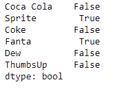
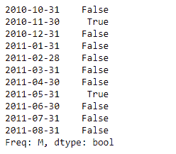

# 蟒蛇|熊猫系列. isin()

> 原文:[https://www.geeksforgeeks.org/python-pandas-series-isin/](https://www.geeksforgeeks.org/python-pandas-series-isin/)

熊猫系列是带有轴标签的一维数组。标签不必是唯一的，但必须是可散列的类型。该对象支持基于整数和基于标签的索引，并提供了一系列方法来执行涉及索引的操作。

熊猫 **Series.isin()** 功能检查 Series 中是否包含值。它返回一个布尔值 Series，显示 Series 中的每个元素是否与传递的值序列中的一个元素完全匹配。

> **语法:** Series.isin(values)
> **参数:**
> **值:**要测试的值的序列。
> **返回:** isin : Series (bool 数据类型)

**示例#1:** 使用 Series.isin()函数检查列表中传递的值是否包含在 Series 对象中。

## 蟒蛇 3

```
# importing pandas as pd
import pandas as pd

# Creating the Series
sr = pd.Series([10, 25, 3, 25, 24, 6])

# Create the Index
index_ = ['Coca Cola', 'Sprite', 'Coke', 'Fanta', 'Dew', 'ThumbsUp']

# set the index
sr.index = index_

# Print the series
print(sr)
```

**输出:**


现在我们将使用 Series.isin()函数来检查传递的值是否包含在 Series 对象中。

## 蟒蛇 3

```
# check if 25 is present
# in the series
result = sr.isin([25])

# Print the result
print(result)
```

**输出:**



正如我们在输出中看到的，Series.isin()函数返回了一个包含布尔值的对象。如果列表中有值，则所有值都已映射为“真”，否则为“假”。

**示例 2 :** 使用 Series.isin()函数检查列表中传递的值是否包含在 Series 对象中。

## 蟒蛇 3

```
# importing pandas as pd
import pandas as pd

# Creating the Series
sr = pd.Series([11, 21, 8, 18, 65, 84, 32, 10, 5, 24, 32])

# Create the Index
index_ = pd.date_range('2010-10-09', periods = 11, freq ='M')

# set the index
sr.index = index_

# Print the series
print(sr)
```

**输出:**


现在我们将使用 Series.isin()函数来检查传递的值是否包含在 Series 对象中。

## 蟒蛇 3

```
# check if 21 and 10 is present
# in the series
result = sr.isin([21, 10])

# Print the result
print(result)
```

**输出:**



正如我们在输出中看到的，Series.isin()函数返回了一个包含布尔值的对象。如果列表中有值，则所有值都已映射为“真”，否则为“假”。