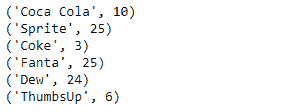
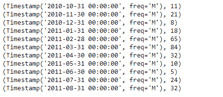

# 蟒蛇|熊猫系列. iteritems()

> 原文:[https://www . geesforgeks . org/python-pandas-series-ITER items/](https://www.geeksforgeeks.org/python-pandas-series-iteritems/)

熊猫系列是带有轴标签的一维数组。标签不必是唯一的，但必须是可散列的类型。该对象支持基于整数和基于标签的索引，并提供了一系列方法来执行涉及索引的操作。

熊猫 `**Series.iteritems()**`函数迭代给定的序列对象。该函数迭代包含索引标签和序列中相应值的元组。

> **语法:** Series.iteritems()
> 
> **参数:**无
> 
> **返回:**元组

**示例#1:** 使用`Series.iteritems()`函数迭代给定系列对象中的所有元素。

```
# importing pandas as pd
import pandas as pd

# Creating the Series
sr = pd.Series([10, 25, 3, 25, 24, 6])

# Create the Index
index_ = ['Coca Cola', 'Sprite', 'Coke', 'Fanta', 'Dew', 'ThumbsUp']

# set the index
sr.index = index_

# Print the series
print(sr)
```

**输出:**


现在我们将使用`Series.iteritems()`函数迭代给定系列对象中的所有元素。

```
# iterate over all the elements
for items in sr.iteritems():
    print(items)
```

**输出:**


正如我们在输出中看到的那样，`Series.iteritems()`函数已经成功迭代了给定序列对象中的所有元素。

**示例 2 :** 使用`Series.iteritems()`函数迭代给定系列对象中的所有元素。

```
# importing pandas as pd
import pandas as pd

# Creating the Series
sr = pd.Series([11, 21, 8, 18, 65, 84, 32, 10, 5, 24, 32])

# Create the Index
index_ = pd.date_range('2010-10-09', periods = 11, freq ='M')

# set the index
sr.index = index_

# Print the series
print(sr)
```

**输出:**


现在我们将使用`Series.iteritems()`函数迭代给定系列对象中的所有元素。

```
# iterate over all the elements
for items in sr.iteritems():
    print(items)
```

**输出:**


正如我们在输出中看到的那样，`Series.iteritems()`函数已经成功迭代了给定序列对象中的所有元素。