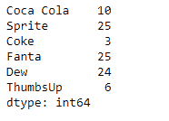

# 蟒蛇|熊猫系列. key()

> 原文:[https://www.geeksforgeeks.org/python-pandas-series-keys/](https://www.geeksforgeeks.org/python-pandas-series-keys/)

熊猫系列是带有轴标签的一维数组。标签不必是唯一的，但必须是可散列的类型。该对象支持基于整数和基于标签的索引，并提供了一系列方法来执行涉及索引的操作。

熊猫 `**Series.keys()**`函数是 index 的别名。它返回给定序列对象的索引标签。

> **语法:**系列.键()
> 
> **参数:**无
> 
> **返回:**指数

**示例#1:** 使用`Series.keys()`函数返回给定序列对象的索引标签。

```py
# importing pandas as pd
import pandas as pd

# Creating the Series
sr = pd.Series([10, 25, 3, 25, 24, 6])

# Create the Index
index_ = ['Coca Cola', 'Sprite', 'Coke', 'Fanta', 'Dew', 'ThumbsUp']

# set the index
sr.index = index_

# Print the series
print(sr)
```

**输出:**



现在我们使用`Series.keys()`函数返回给定序列对象的索引标签。

```py
# return the keys
result = sr.keys()

# Print the result
print(result)
```

**输出:**


正如我们在输出中看到的，`Series.keys()`函数已经返回了给定序列对象的所有索引标签。

**例 2 :** 使用`Series.keys()`函数返回给定序列对象的索引标签。

```py
# importing pandas as pd
import pandas as pd

# Creating the Series
sr = pd.Series([11, 21, 8, 18, 65, 84, 32, 10, 5, 24, 32])

# Create the Index
index_ = pd.date_range('2010-10-09', periods = 11, freq ='M')

# set the index
sr.index = index_

# Print the series
print(sr)
```

**输出:**


现在我们使用`Series.keys()`函数返回给定序列对象的索引标签。

```py
# return the keys
result = sr.keys()

# Print the result
print(result)
```

**输出:**

正如我们在输出中看到的，`Series.keys()`函数已经返回了给定序列对象的所有索引标签。