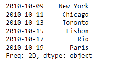
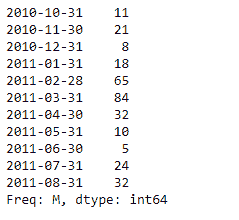

# 蟒蛇|熊猫系列. last()

> 原文:[https://www.geeksforgeeks.org/python-pandas-series-last/](https://www.geeksforgeeks.org/python-pandas-series-last/)

熊猫系列是带有轴标签的一维数组。标签不必是唯一的，但必须是可散列的类型。该对象支持基于整数和基于标签的索引，并提供了一系列方法来执行涉及索引的操作。

Pandas `**Series.last()**`功能是一种方便的方法，用于根据日期偏移设置时间序列数据的最终周期。

> **语法:**序列. last(偏移量)
> 
> **参数:**
> **偏移:**字符串，日期偏移，日期实用程序。相对偏移
> 
> **返回:**子集:与调用者类型相同

**示例#1:** 使用`Series.last()`函数返回给定系列对象中最近 5 天的条目。

```py
# importing pandas as pd
import pandas as pd

# Creating the Series
sr = pd.Series(['New York', 'Chicago', 'Toronto', 'Lisbon', 'Rio', 'Paris'])

# Create the Index
index_ = pd.date_range('2010-10-09', periods = 6, freq ='2D')

# set the index
sr.index = index_

# Print the series
print(sr)
```

**输出:**


现在我们将使用`Series.last()`函数返回给定系列对象中最近 5 天的条目。

```py
# return the entries of last 5 days
result = sr.last('5D')

# Print the result
print(result)
```

**输出:**

正如我们在输出中看到的，`Series.last()`函数已经返回了给定系列对象中最近 5 天的条目。请注意，该函数没有返回最后 5 个条目，而是返回了最后 5 天的条目。

**示例 2 :** 使用`Series.last()`功能返回给定系列对象中最近 4 个月的条目。

```py
# importing pandas as pd
import pandas as pd

# Creating the Series
sr = pd.Series([11, 21, 8, 18, 65, 84, 32, 10, 5, 24, 32])

# Create the Index
index_ = pd.date_range('2010-10-09', periods = 11, freq ='M')

# set the index
sr.index = index_

# Print the series
print(sr)
```

**输出:**


现在我们将使用`Series.last()`函数返回给定系列对象中最近 4 个月的条目。

```py
# return the entries of last 4 Months
result = sr.last('4M')

# Print the result
print(result)
```

**输出:**

正如我们在输出中看到的，`Series.last()`函数已经返回了给定系列对象中最近 4 个月的条目。