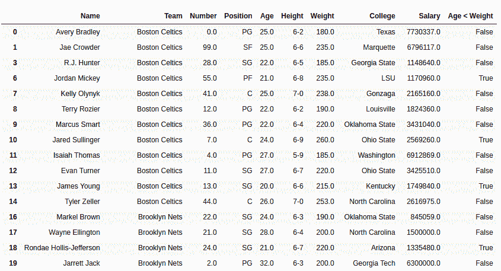

# 蟒蛇|熊猫系列. lt()

> 原文:[https://www.geeksforgeeks.org/python-pandas-series-lt/](https://www.geeksforgeeks.org/python-pandas-series-lt/)

Python 是进行数据分析的优秀语言，主要是因为以数据为中心的 Python 包的奇妙生态系统。 ***【熊猫】*** 就是其中一个包，让导入和分析数据变得容易多了。

熊猫 **`Series.lt()`** 用于比较两个序列，并返回每个相应元素的布尔值。

> **语法:** Series.lt(其他，级别=无，fill _ value =无，轴=0)
> 
> **参数:**
> **其他:**要与
> **进行比较的其他系列级别:**多级别情况下的 int 或级别名称
> **fill_value:** 要替换的值而不是 NaN
> **轴:** 0 或“index”按行应用方法，1 或“columns”按列应用方法。
> 
> **返回类型:**布尔级数

**注:**在对比来电者系列<其他系列的基础上返回结果。

要下载下例使用的数据集，点击这里的[。](https://media.geeksforgeeks.org/wp-content/uploads/nba.csv)

在下面的例子中，使用的数据框包含了一些 NBA 球员的数据。任何操作前的数据框图像附在下面。


**示例#1:**

在本例中，年龄列和体重列使用进行比较。lt()方法。由于权重列中的值与年龄列相比非常大，因此首先将值除以 10。在比较之前，使用删除空行。方法来避免错误。

```
# importing pandas module 
import pandas as pd 

# making data frame 
data = pd.read_csv("https://media.geeksforgeeks.org/wp-content/uploads/nba.csv") 

# removing null values to avoid errors 
data.dropna(inplace = True) 

# other series
other = data["Weight"]/10

# calling method and returning to new column
data["Age < Weight"]= data["Age"].lt(other)

# display
data
```

**输出:**
如输出图像所示，只要“年龄”列中的值小于“体重/10”，新列就会为“真”。


**示例 2:** 处理 NaN 值

在本例中，使用`pd.Series()`创建了两个系列。该序列也包含空值，因此将 10 传递给 fill_value 参数，用 10 替换空值。

```
# importing pandas module 
import pandas as pd 

# importing numpy module
import numpy as np

# creating series 1
series1 = pd.Series([11, 21, 2, 43, 9, 27, np.nan, 110, np.nan])

# creating series 2
series2 = pd.Series([16, np.nan, 2, 23, 5, 40, np.nan, 0, 19])

# setting null replacement value
na_replace = 10

# calling and storing result
result = series1.lt(series2, fill_value = na_replace)

# display
result
```

**输出:**
从输出中可以看出，NaN 值被替换为 5，替换后进行比较，使用新值进行比较。

```
0     True
1    False
2    False
3    False
4    False
5     True
6    False
7    False
8     True
dtype: bool

```