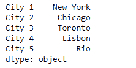
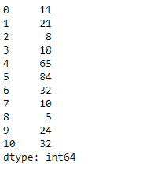
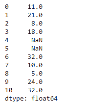

# Python |熊猫系列. mask()

> 原文:[https://www.geeksforgeeks.org/python-pandas-series-mask/](https://www.geeksforgeeks.org/python-pandas-series-mask/)

熊猫系列是带有轴标签的一维数组。标签不必是唯一的，但必须是可散列的类型。该对象支持基于整数和基于标签的索引，并提供了一系列方法来执行涉及索引的操作。

熊猫 `**Series.mask()**`功能用于屏蔽目的。该功能替换通过条件为`True`的值。否则该值保持不变。

> **语法:** Series.mask(cond，other=nan，inplace=False，axis=None，level=None，errors='raise '，try_cast=False，raise_on_error=None)
> 
> **参数:**
> **cond :** 其中 cond 为 False，保留原值。如果为真，则替换为来自其他的相应值。
> **其他:【cond 为真的条目将替换为其他条目的相应值。
> **到位:**是否对数据执行到位操作。
> **轴:**如有需要对齐轴。
> **级:**对齐级如有需要。**
> 
> **返回:** wh:与来电者类型相同

**示例#1:** 使用`Series.mask()`函数替换给定系列对象中的‘里约’城市。

```py
# importing pandas as pd
import pandas as pd

# Creating the Series
sr = pd.Series(['New York', 'Chicago', 'Toronto', 'Lisbon', 'Rio'])

# Create the Index
index_ = ['City 1', 'City 2', 'City 3', 'City 4', 'City 5'] 

# set the index
sr.index = index_

# Print the series
print(sr)
```

**输出:**



现在我们将使用`Series.mask()`函数替换给定系列对象中的‘里约’城市。

```py
# replace 'Rio' with 'Tokyo'
result = sr.mask(lambda x : x =='Rio', other = 'Tokyo')

# Print the result
print(result)
```

**输出:**


我们可以在输出中看到，`Series.mask()`函数已经成功地将给定系列对象中的‘里约’城市替换为‘东京’。

**示例 2:** 使用`Series.mask()`函数屏蔽给定序列对象中大于 50 的所有值。

```py
# importing pandas as pd
import pandas as pd

# Creating the Series
sr = pd.Series([11, 21, 8, 18, 65, 84, 32, 10, 5, 24, 32])

# Print the series
print(sr)
```

**输出:**


现在我们将使用`Series.mask()`函数屏蔽给定序列对象中所有大于 50 的值。

```py
# mask values greater than 50
result = sr.mask(sr > 50)

# Print the result
print(result)
```

**输出:**

正如我们在输出中所看到的，`Series.mask()`函数已经成功屏蔽了给定序列对象中所有大于 50 的值。