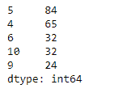

# Python | Pandas series . nlargetst()

> 原文:[https://www . geesforgeks . org/python-pandas-series-nlargest/](https://www.geeksforgeeks.org/python-pandas-series-nlargest/)

熊猫系列是带有轴标签的一维数组。标签不必是唯一的，但必须是可散列的类型。该对象支持基于整数和基于标签的索引，并提供了一系列方法来执行涉及索引的操作。

Pandas `**Series.nlargest()**`函数返回给定序列对象中基础数据的 n 个最大元素。

> **语法:** Series.nlargest(n=5，keep='first ')
> 
> **参数:**
> **n :** 返回这许多降序排序的值。
> **keep :** {'first '，' last '，' all'}，默认' first '
> 
> **返回:**系列

**示例#1:** 使用`Series.nlargest()`函数返回给定序列对象的第一个 n 大元素。

```
# importing pandas as pd
import pandas as pd

# Creating the Series
sr = pd.Series([10, 25, 3, 11, 24, 6])

# Create the Index
index_ = ['Coca Cola', 'Sprite', 'Coke', 'Fanta', 'Dew', 'ThumbsUp']

# set the index
sr.index = index_

# Print the series
print(sr)
```

**输出:**


现在我们将使用`Series.nlargest()`函数找到给定序列对象中的前 2 个最大值。

```
# return the first 2 of the largest
# element
result = sr.nlargest(n = 2)

# Print the result
print(result)
```

**输出:**


正如我们在输出中看到的，`Series.nlargest()`函数已经成功返回了给定序列对象中的前 2 个最大值。

**示例 2:** 使用`Series.nlargest()`函数返回给定序列对象的第一个 n 大元素。

```
# importing pandas as pd
import pandas as pd

# Creating the Series
sr = pd.Series([11, 21, 8, 18, 65, 84, 32, 10, 5, 24, 32])

# Print the series
print(sr)
```

**输出:**


现在我们将使用`Series.nlargest()`函数找到给定序列对象中的前 5 个最大值。

```
# return the first 5 of the largest
# element
result = sr.nlargest(n = 5)

# Print the result
print(result)
```

**输出:**



我们可以在输出中看到，`Series.nlargest()`函数已经成功返回了给定序列对象中的前 5 个最大值。