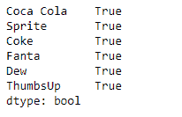
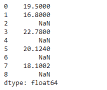

# 蟒蛇|熊猫系列. notna()

> 原文:[https://www.geeksforgeeks.org/python-pandas-series-notna/](https://www.geeksforgeeks.org/python-pandas-series-notna/)

熊猫系列是带有轴标签的一维数组。标签不必是唯一的，但必须是可散列的类型。该对象支持基于整数和基于标签的索引，并提供了一系列方法来执行涉及索引的操作。

熊猫 `**Series.notna()**`功能检测现有(非缺失)值。此函数返回一个与对象大小相同的布尔对象，指示值是否缺失。非缺失值映射到*真*。空字符串”或`numpy.inf`等字符不被视为数值(除非设置了 pandas . options . mode . use _ INF _ as _ NA = True)。数值，如无或数值。NaN，映射到 False 值。

> **语法:** Series.notna()
> 
> **参数:**无
> 
> **返回:**系列

**示例#1:** 使用`Series.notna()`功能检测给定序列对象中的所有非缺失值。

```py
# importing pandas as pd
import pandas as pd

# Creating the Series
sr = pd.Series([10, 25, 3, 11, 24, 6])

# Create the Index
index_ = ['Coca Cola', 'Sprite', 'Coke', 'Fanta', 'Dew', 'ThumbsUp']

# set the index
sr.index = index_

# Print the series
print(sr)
```

**输出:**


现在我们将使用`Series.notna()`函数来检测序列对象中的非缺失值。

```py
# detect non-missing value
result = sr.notna()

# Print the result
print(result)
```

**输出:**



正如我们在输出中看到的那样，`Series.notna()`函数返回了一个布尔对象。`True`表示对应的值没有缺失。`False`值表示缺少该值。该系列中的所有值都为真，因为没有缺失值。

**示例#2:** 使用`Series.notna()`功能检测给定序列对象中的所有非缺失值。

```py
# importing pandas as pd
import pandas as pd

# Creating the Series
sr = pd.Series([19.5, 16.8, None, 22.78, None, 20.124, None, 18.1002, None])

# Print the series
print(sr)
```

**输出:**



现在我们将使用`Series.notna()`函数来检测序列对象中的非缺失值。

```py
# detect non-missing value
result = sr.notna()

# Print the result
print(result)
```

**输出:**


正如我们在输出中看到的那样，`Series.notna()`函数返回了一个布尔对象。`True`表示对应的值没有缺失。`False`值表示缺少该值。