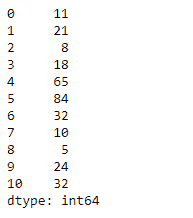

# 蟒蛇|熊猫系列.分位数()

> 原文:[https://www . geesforgeks . org/python-pandas-series-quantile/](https://www.geeksforgeeks.org/python-pandas-series-quantile/)

熊猫系列是带有轴标签的一维数组。标签不必是唯一的，但必须是可散列的类型。该对象支持基于整数和基于标签的索引，并提供了一系列方法来执行涉及索引的操作。

熊猫 `**Series.quantile()**`函数返回给定序列对象中基础数据的给定分位数的值。

> **语法:**级数.分位数(q=0.5，插值= '线性')
> 
> **参数:**
> **q :** 浮点或数组状，默认 0.5 (50%分位数)
> **插值:** { '线性'，'较低'，'较高'，'中点'，'最近' }
> 
> **返回:**分位数:浮点数或数列

**示例#1:** 使用`Series.quantile()`函数返回给定序列对象中基础数据的期望分位数。

```
# importing pandas as pd
import pandas as pd

# Creating the Series
sr = pd.Series([10, 25, 3, 11, 24, 6])

# Create the Index
index_ = ['Coca Cola', 'Sprite', 'Coke', 'Fanta', 'Dew', 'ThumbsUp']

# set the index
sr.index = index_

# Print the series
print(sr)
```

**输出:**


现在我们将使用`Series.quantile()`函数找到给定序列对象中底层数据的 40%分位数。

```
# return the value of 40 % quantile
result = sr.quantile(q = 0.4)

# Print the result
print(result)
```

**输出:**


正如我们在输出中看到的那样，`Series.quantile()`函数已经成功地返回了给定 Series 对象的底层数据的所需值。

**示例#2:** 使用`Series.quantile()`函数返回给定序列对象中基础数据的期望分位数。

```
# importing pandas as pd
import pandas as pd

# Creating the Series
sr = pd.Series([11, 21, 8, 18, 65, 84, 32, 10, 5, 24, 32])

# Print the series
print(sr)
```

**输出:**



现在我们将使用`Series.quantile()`函数找到给定序列对象中底层数据的 90%分位数。

```
# return the value of 90 % quantile
result = sr.quantile(q = 0.9)

# Print the result
print(result)
```

**输出:**


正如我们在输出中看到的那样，`Series.quantile()`函数已经成功地返回了给定 Series 对象的底层数据的所需值。