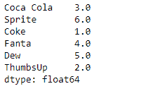
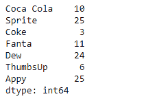
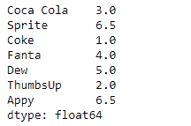

# 蟒蛇|熊猫系列. rank()

> 原文:[https://www.geeksforgeeks.org/python-pandas-series-rank/](https://www.geeksforgeeks.org/python-pandas-series-rank/)

熊猫系列是带有轴标签的一维数组。标签不必是唯一的，但必须是可散列的类型。该对象支持基于整数和基于标签的索引，并提供了一系列方法来执行涉及索引的操作。

熊猫 `**Series.rank()**`功能计算沿轴的数值数据等级(1 到 n)。相等的值被分配一个等级，该等级是这些值的等级的平均值。

> **语法:** Series.rank(axis=0，method='average '，numeric_only=None，na_option='keep '，升序=True，pct=False)
> 
> **参数:**
> **轴:**指标直接排名
> **方法:** { '平均'，'最小'，'最大'，'第一'，'密集' }
> **数值 _ 仅:**仅包含浮点、int、布尔数据。仅对数据框或面板对象有效
> **na_option :** { '保留'，'顶部'，'底部' }
> **升序:**按高(1)到低(N)
> **pct :** 计算数据的百分比等级
> 
> **返回:**等级:与调用者类型相同

**示例#1:** 使用`Series.rank()`函数对给定序列对象的基础数据进行排序。

```
# importing pandas as pd
import pandas as pd

# Creating the Series
sr = pd.Series([10, 25, 3, 11, 24, 6])

# Create the Index
index_ = ['Coca Cola', 'Sprite', 'Coke', 'Fanta', 'Dew', 'ThumbsUp']

# set the index
sr.index = index_

# Print the series
print(sr)
```

**输出:**


现在我们将使用`Series.rank()`函数返回给定 Series 对象的底层数据的排名。

```
# assign rank
result = sr.rank()

# Print the result
print(result)
```

**输出:**



正如我们在输出中看到的那样，`Series.rank()`函数已经为给定 Series 对象的每个元素分配了等级。

**示例#2:** 使用`Series.rank()`函数对给定序列对象的基础数据进行排序。给定的数据也包含一些相等的值。

```
# importing pandas as pd
import pandas as pd

# Creating the Series
sr = pd.Series([10, 25, 3, 11, 24, 6, 25])

# Create the Index
index_ = ['Coca Cola', 'Sprite', 'Coke', 'Fanta', 'Dew', 'ThumbsUp', 'Appy']

# set the index
sr.index = index_

# Print the series
print(sr)
```

**输出:**



现在我们将使用`Series.rank()`函数返回给定 Series 对象的底层数据的排名。

```
# assign rank
result = sr.rank()

# Print the result
print(result)
```

**输出:**



正如我们在输出中看到的那样，`Series.rank()`函数已经为给定 Series 对象的每个元素分配了等级。请注意，相等的值被分配了一个等级，这是它们等级的平均值。