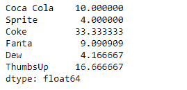
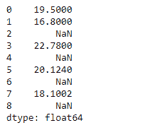
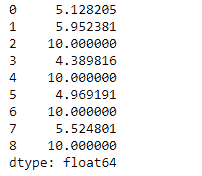

# 蟒蛇|熊猫系列. rdiv()

> 原文:[https://www.geeksforgeeks.org/python-pandas-series-rdiv/](https://www.geeksforgeeks.org/python-pandas-series-rdiv/)

熊猫系列是带有轴标签的一维数组。标签不必是唯一的，但必须是可散列的类型。该对象支持基于整数和基于标签的索引，并提供了一系列方法来执行涉及索引的操作。

熊猫 `**Series.rdiv()**`功能执行系列和其他元素的浮动划分。该操作等同于其他/系列，但支持用 fill_value 替换其中一个输入中缺失的数据。

> **语法:** Series.rdiv(其他，级别=无，fill _ value =无，轴=0)
> 
> **参数:**
> **其他:**系列或标量值
> **填充 _ 值:**填充现有缺失(NaN)值
> **等级:**跨一级广播，
> 
> **返回:**结果:系列

**示例#1:** 使用`Series.rdiv()`函数对给定的序列对象执行标量的浮点除法。

```py
# importing pandas as pd
import pandas as pd

# Creating the Series
sr = pd.Series([10, 25, 3, 11, 24, 6])

# Create the Index
index_ = ['Coca Cola', 'Sprite', 'Coke', 'Fanta', 'Dew', 'ThumbsUp']

# set the index
sr.index = index_

# Print the series
print(sr)
```

**输出:**


现在我们使用`Series.rdiv()`函数对级数进行标量的浮点除法。

```py
# divide the given value with series
result = sr.rdiv(other = 100)

# Print the result
print(result)
```

**输出:**



正如我们在输出中看到的，`Series.rdiv()`函数返回了给定标量与级数对象的浮点除法结果。

**示例#2:** 使用`Series.rdiv()`函数对给定的序列对象执行标量的浮点除法。给定的序列对象包含一些缺失的值。

```py
# importing pandas as pd
import pandas as pd

# Creating the Series
sr = pd.Series([19.5, 16.8, None, 22.78, None, 20.124, None, 18.1002, None])

# Print the series
print(sr)
```

**输出:**



现在我们使用`Series.rdiv()`函数对级数进行标量的浮点除法。我们将在序列中所有缺失值的位置填充 10。

```py
# divide the given value with series
result = sr.rdiv(other = 100, fill_value = 10)

# Print the result
print(result)
```

**输出:**



正如我们在输出中看到的，`Series.rdiv()`函数返回了给定标量与级数对象的浮点除法结果。