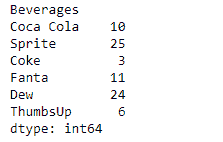

# Python | Pandas series . rename _ axis()

> 原文:[https://www . geesforgeks . org/python-pandas-series-rename _ axis/](https://www.geeksforgeeks.org/python-pandas-series-rename_axis/)

熊猫系列是带有轴标签的一维数组。标签不必是唯一的，但必须是可散列的类型。该对象支持基于整数和基于标签的索引，并提供了一系列方法来执行涉及索引的操作。

Pandas `**Series.rename_axis()**`功能用于设置索引或列的轴名。

> **语法:** Series.rename_axis(映射器=无，索引=无，列=无，轴=无，复制=真，就地=假)
> 
> **参数:**
> **映射器:**值设置轴名属性。
> **索引、列:**应用于该轴值的标量、列表、字典或函数转换。
> **轴:**要重命名的轴。
> **复制:**同样复制底层数据。
> **在位:**直接修改对象，而不是创建新的系列或数据帧。
> 
> **返回:**序列、数据帧或无

**示例#1:** 使用`Series.rename_axis()`功能重命名给定系列对象的轴。

```
# importing pandas as pd
import pandas as pd

# Creating the Series
sr = pd.Series([10, 25, 3, 11, 24, 6])

# Create the Index
index_ = ['Coca Cola', 'Sprite', 'Coke', 'Fanta', 'Dew', 'ThumbsUp']

# set the index
sr.index = index_

# Print the series
print(sr)
```

**输出:**


现在我们将使用`Series.rename_axis()`函数来重命名给定系列对象的轴。

```
# rename the axis
result = sr.rename_axis('Beverages')

# Print the result
print(result)
```

**输出:**


正如我们在输出中看到的，`Series.rename_axis()`函数已经成功地重命名了给定系列对象的轴。

**示例 2 :** 使用`Series.rename_axis()`功能重命名给定序列对象的多索引轴。

```
# importing pandas as pd
import pandas as pd

# Creating the Series
sr = pd.Series(['New York', 'Chicago', 'Toronto', 'Lisbon', 'Rio'])

# Create the MultiIndex
index_ = pd.MultiIndex.from_product([['Names'], ['City 1', 'City 2', 'City 3', 'City 4', 'City 5']],
                                                                     names =['Level 1', 'Level 2'])

# set the index
sr.index = index_

# Print the series
print(sr)
```

**输出:**


现在我们将使用`Series.rename_axis()`函数来重命名给定系列对象的轴。

```
# rename both the levels of the axis of 
# the given series object
result = sr.rename_axis(['First_level', 'Second_level'])

# Print the result
print(result)
```

**输出:**

正如我们在输出中看到的，`Series.rename_axis()`函数已经成功地重命名了给定系列对象的轴的两个级别。