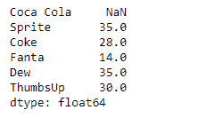
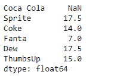

# Python |熊猫系列. rolling()

> 原文:[https://www.geeksforgeeks.org/python-pandas-series-rolling/](https://www.geeksforgeeks.org/python-pandas-series-rolling/)

[熊猫系列](https://www.geeksforgeeks.org/python-pandas-series/)是带有轴标签的一维数组。标签不必是唯一的，但必须是可散列的类型。该对象支持整数索引和基于标签的索引，并提供了一系列方法来执行涉及索引的操作。

熊猫 `**Series.rolling()**`功能是一个非常有用的功能。它对给定序列对象中的基础数据提供滚动窗口计算。

> **语法:**系列.滚动(窗口，最小周期=无，中心=假，win _ type =无，开=无，轴=0，关闭=无)
> 
> **参数:**
> **窗口:**移动窗口的大小
> **min_periods :** 窗口中需要有值的最小观察次数
> **中心:**在窗口中心设置标签。
> **win_type :** 提供窗口类型。
> **on :** str，可选
> **轴:** int 或 str，默认 0
> **closed :** 使区间在‘右’、‘左’、‘两者’或‘两者都不是’端点闭合。
> 
> **返回:**特定操作的窗口或滚动子类

**示例#1:** 使用`Series.rolling()`函数为给定的 Series 对象查找基础数据的滚动窗口总和。滚动窗口的大小应为 2，每个元素的权重应相同。

```
# importing pandas as pd
import pandas as pd

# Creating the Series
sr = pd.Series([10, 25, 3, 11, 24, 6])

# Create the Index
index_ = ['Coca Cola', 'Sprite', 'Coke', 'Fanta', 'Dew', 'ThumbsUp']

# set the index
sr.index = index_

# Print the series
print(sr)
```

**输出:**


现在我们将使用`Series.rolling()`函数来查找窗口大小为 2 的底层数据的总和。

```
# Find sum over a window size of 2
result = sr.rolling(2).sum()

# Print the returned Series object
print(result)
```

**输出:**

正如我们在输出中看到的，`Series.rolling()`函数已经成功地返回了一个序列对象，该对象已经找到了窗口大小为 2 的底层数据的总和。请注意，第一个值是一个缺失的值，因为它之前没有元素，所以无法执行求和。

**示例#2:** 使用`Series.rolling()`函数查找给定 Series 对象的底层数据的滚动窗口和。滚动窗口的大小应为 2，滚动窗口类型应为“三角形”。

```
# importing pandas as pd
import pandas as pd

# Creating the Series
sr = pd.Series([10, 25, 3, 11, 24, 6])

# Create the Index
index_ = ['Coca Cola', 'Sprite', 'Coke', 'Fanta', 'Dew', 'ThumbsUp']

# set the index
sr.index = index_

# Print the series
print(sr)
```

**输出:**


现在我们将使用`Series.rolling()`函数来查找窗口大小为 2 的底层数据的总和。

```
# Find sum over a window size of 2
# We have also provided the window type
result = sr.rolling(2, win_type ='triang').sum()

# Print the returned Series object
print(result)
```

**输出:**



正如我们在输出中看到的那样，`Series.rolling()`函数已经成功地返回了一个序列对象，该对象已经找到了窗口大小为 2 的基础数据的总和。请注意，第一个值是一个缺失的值，因为它之前没有元素，所以无法执行求和。