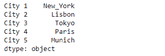
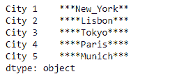

# Python | Pandas series . str . center()

> 原文:[https://www . geesforgeks . org/python-pandas-series-str-center/](https://www.geeksforgeeks.org/python-pandas-series-str-center/)

`Series.str`可用于以字符串形式访问系列的值，并对其应用多种方法。熊猫 `**Series.str.center()**`功能用于在序列/索引中的字符串的左侧和右侧填充一个附加字符。功能相当于 Python 的`str.center()`。

> **语法:** Series.str.center(宽度，fillchar= ' ')
> 
> **参数:**
> **宽度:**结果字符串的最小宽度；附加字符将用 fillchar 填充
> **fillchar :** 附加字符用于填充，默认为空白
> 
> **返回:**填充

**示例#1:** 使用`Series.str.center()`函数，用“*”符号填充给定序列对象的基础数据中字符串的左侧和右侧。

```py
# importing pandas as pd
import pandas as pd

# Creating the Series
sr = pd.Series(['New_York', 'Lisbon', 'Tokyo', 'Paris', 'Munich'])

# Creating the index
idx = ['City 1', 'City 2', 'City 3', 'City 4', 'City 5']

# set the index
sr.index = idx

# Print the series
print(sr)
```

**输出:**



现在我们使用`Series.str.center()`函数在字符串的左右两边填充“*”符号。

```py
# fill '*' in the left and right side of string
result = sr.str.center(width = 13, fillchar = '*')

# print the result
print(result)
```

**输出:**



正如我们在输出中看到的，`Series.str.center()`函数已经成功填充了给定序列对象的底层数据中字符串左侧和右侧的“*”符号。

**示例#2 :** 使用`Series.str.center()`函数，用“*”符号填充给定序列对象的基础数据中字符串的左侧和右侧。

```py
# importing pandas as pd
import pandas as pd

# Creating the Series
sr = pd.Series(['Mike', 'Alessa', 'Nick', 'Kim', 'Britney'])

# Creating the index
idx = ['Name 1', 'Name 2', 'Name 3', 'Name 4', 'Name 5']

# set the index
sr.index = idx

# Print the series
print(sr)
```

**输出:**


现在我们使用`Series.str.center()`函数在字符串的左右两边填充“*”符号。

```py
# fill '*' in the left and right side of string
# width after filling should be 5
result = sr.str.center(width = 5, fillchar = '*')

# print the result
print(result)
```

**输出:**


正如我们在输出中看到的，`Series.str.center()`函数已经成功填充了给定序列对象的底层数据中字符串左侧和右侧的“*”符号。

**注意:**如果宽度值小于实际字符串的长度，则打印整个字符串而不截断它。