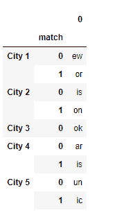
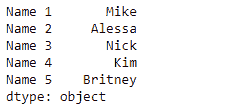

# Python | Pandas series . str . extracall()

> 原文:[https://www . geesforgeks . org/python-pandas-series-str-extracall/](https://www.geeksforgeeks.org/python-pandas-series-str-extractall/)

`Series.str`可用于以字符串形式访问系列的值，并对其应用多种方法。Pandas `**Series.str.extractall()**`函数用于将正则表达式 pat 中的捕获组提取为数据帧中的列。对于系列中的每个主题字符串，从正则表达式的所有匹配项中提取组。当系列中的每个主题字符串只有一个匹配项时，提取全部(pat)。xs(0，级别='match ')与 extract(pat)相同。

> **语法:**series . str . extracall(pat，flags=0)
> 
> **参数:**
> **拍:**带捕捉组的正则表达式模式。
> **标志:**一个 re 模块标志，例如 re.IGNORECASE。
> 
> **返回:**数据帧

**示例#1:** 使用`Series.str.extractall()`函数从给定序列对象的基础数据中的字符串中提取所有组。

```
# importing pandas as pd
import pandas as pd

# importing re for regular expressions
import re

# Creating the Series
sr = pd.Series(['New_York', 'Lisbon', 'Tokyo', 'Paris', 'Munich'])

# Creating the index
idx = ['City 1', 'City 2', 'City 3', 'City 4', 'City 5']

# set the index
sr.index = idx

# Print the series
print(sr)
```

**输出:**


现在我们将使用`Series.str.extractall()`函数从给定序列对象中的字符串中提取所有组。

```
# extract all groups having a vowel followed by
# any character
result = sr.str.extractall(pat = '([aeiou].)')

# print the result
print(result)
```

**输出:**



正如我们在输出中看到的那样，`Series.str.extractall()`函数返回了一个包含所有提取组的一列的数据帧。

**示例 2 :** 使用`Series.str.extractall()`函数从给定序列对象的基础数据中的字符串中提取所有组。

```
# importing pandas as pd
import pandas as pd

# importing re for regular expressions
import re

# Creating the Series
sr = pd.Series(['Mike', 'Alessa', 'Nick', 'Kim', 'Britney'])

# Creating the index
idx = ['Name 1', 'Name 2', 'Name 3', 'Name 4', 'Name 5']

# set the index
sr.index = idx

# Print the series
print(sr)
```

**输出:**



现在我们将使用`Series.str.extractall()`函数从给定序列对象中的字符串中提取所有组。

```
# extract all groups having any capital letter
# followed by 'i' and any other character
result = sr.str.extractall(pat = '([A-Z]i.)')

# print the result
print(result)
```

**输出:**


正如我们在输出中看到的那样，`Series.str.extractall()`函数返回了一个包含所有提取组的一列的数据帧。