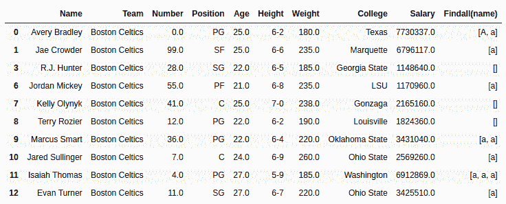

# Python | Pandas series . str . findall()

> 原文:[https://www . geesforgeks . org/python-pandas-series-str-find all/](https://www.geeksforgeeks.org/python-pandas-series-str-findall/)

Python 是进行数据分析的优秀语言，主要是因为以数据为中心的 Python 包的奇妙生态系统。 ***【熊猫】*** 就是其中一个包，让导入和分析数据变得容易多了。

熊猫 **`str.findall()`** 方法也用于在序列中的每个字符串中查找子字符串或分隔符。但它不同于 [str.find()](https://www.geeksforgeeks.org/python-pandas-series-str-find/) 方法。它不返回索引，而是返回包含子字符串的列表，列表的大小是它出现的次数。

> **语法:** Series.str.findall(pat，flags=0)
> 
> **参数:**
> **pat:** 要搜索的子串
> **标志:**可以传递的 Regex 标志(A、S、L、M、I、X)，默认值为 0，表示无。对于这个正则表达式模块(re)也必须导入。
> 
> **返回类型:**系列列表(字符串)。

要下载代码中使用的 CSV，点击这里的[。](https://media.geeksforgeeks.org/wp-content/uploads/nba.csv)

在下面的例子中，使用的数据框包含了一些 NBA 球员的数据。任何操作前的数据框图像附在下面。


**示例#1:** 搜索字符串中的字符

在本例中，使用 str.findall()方法在名称列中搜索“r”，并将输出存储在新列中。在执行任何操作之前，使用。dropna()以避免错误。

```
# importing pandas module 
import pandas as pd 

# making data frame 
data = pd.read_csv("https://media.geeksforgeeks.org/wp-content/uploads/nba.csv") 

# removing null values to avoid errors 
data.dropna(inplace = True) 

# string to be searched for
search ='r'

# returning values and creating column
data["Findall(name)"]= data["Name"].str.findall(search)

# display
data.head(10)
```

**输出:**
如输出图所示，可以比较返回的‘e’的个数等于它在字符串中出现的次数。


**示例 2:** 搜索字符并传递 IGNORECASE 标志

在本例中，在“名称”列中搜索“a”，并传递 IGNORECASE 标志。因为环形模块也必须导入。str.findall()方法返回的序列存储在 New 列中。

```
# importing pandas module 
import pandas as pd 

# importing regex module
import re

# making data frame 
data = pd.read_csv("https://media.geeksforgeeks.org/wp-content/uploads/nba.csv") 

# removing null values to avoid errors 
data.dropna(inplace = True) 

# string to be searched for
search ='a'

# returning values and creating column
data["Findall(name)"]= data["Name"].str.findall(search, flags = re.I)

# display
data.head(10)
```

**输出:**
如输出图像所示，从第一行本身可以看出，从 IGNORECASE 标志(re)开始，返回了‘A’和‘A’。我)通过了。
