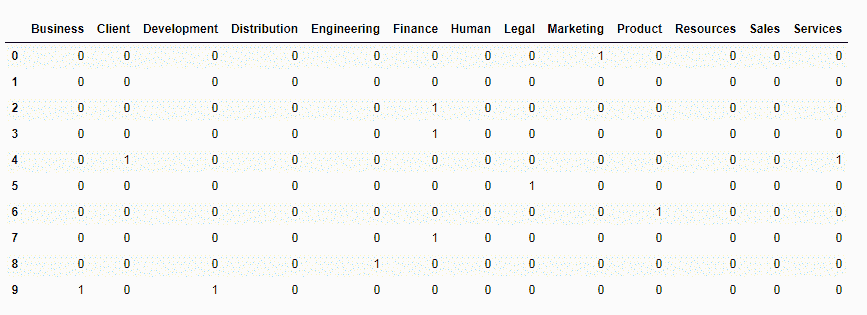
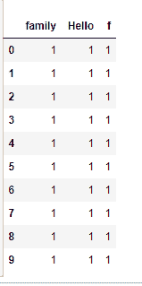

# Python | Pandas series . str . get _ dummies()

> 原文:[https://www . geesforgeks . org/python-pandas-series-str-get _ dummies/](https://www.geeksforgeeks.org/python-pandas-series-str-get_dummies/)

Python 是进行数据分析的优秀语言，主要是因为以数据为中心的 Python 包的奇妙生态系统。 ***【熊猫】*** 就是其中一个包，让导入和分析数据变得容易多了。

熊猫 **`str.get_dummies()`** 用于在传递的分隔符处分隔调用者序列中的每个字符串。拆分每个字符串后，将返回一个包含所有可能值的数据帧。如果同一索引处的原始数据框中的文本值包含字符串(列名/拆分值)，则该位置的值为 1，否则为 0。

既然是字符串操作， ***。str*** 每次调用这个函数之前都要加上前缀。否则，它将抛出一个错误。

> **语法:**series . str . get _ dummies(sep = ' | ')
> 
> **参数:**
> **sep:** 字符串值，分隔符用于在
> 
> **返回类型:**仅包含二进制值的数据帧

要下载以下示例中使用的数据集，请单击此处的[。](https://media.geeksforgeeks.org/wp-content/uploads/employees.csv)

在以下示例中，使用的数据框包含一些员工的数据。任何操作前的数据框图像附在下面。


**示例#1:** 在空白上分隔不同的字符串。

在本例中，“团队”列中的字符串在" "(空白)处被拆分，数据框在拆分后返回所有可能的值。如果字符串(列名)存在于旧数据框中同一索引处的文本值中，则返回的数据框中的值为 1。

## 蟒蛇 3

```
# importing pandas
import pandas as pd

# making data frame from csv at url
data = pd.read_csv("https://media.geeksforgeeks.org/wp-content/uploads/employees.csv")

# making dataframe using get_dummies()
dummies = data["Team"].str.get_dummies(" ")

# display
dummies.head(10)
```

**输出:**
如输出图像所示，可以与数据帧的原始图像进行对比。如果该字符串存在于同一索引中，则值为 1，否则为 0。


**要点:**

*   如果字符串不为空，则在同一索引中至少有一列的值为 1。*   If the value is null, then all columns will have 0 value at that index (Can be seen at 2nd element in above example)

    **例 2:** 多点分裂/静态值列

    在本例中，为新列取了一个静态值(“Hello gfg 系列”)。然后应用 get_dummies()方法，字符串在“g”处分开。由于“g”出现不止一次，因此将会有多个列，并且所有列中的值必须相同，因为字符串对于所有行也是相同的。

    ## 蟒蛇 3

    ```
    # importing pandas
    import pandas as pd

    # making data frame from csv at url
    data = pd.read_csv("https://media.geeksforgeeks.org/wp-content/uploads/employees.csv")

    # string for new column
    string ="Hello gfg family"

    # creating new column
    data["New_column"]= string

    # creating dummies
    df = data["New_column"].str.get_dummies("g")

    # display
    df.head(10)
    ```

    **输出:**
    如输出图像所示，新的数据帧有 3 列，每行都有相同的值。
    