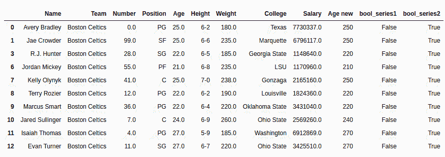

# Python | Pandas series . str . isdigit()

> 原文:[https://www . geesforgeks . org/python-pandas-series-str-isdigit/](https://www.geeksforgeeks.org/python-pandas-series-str-isdigit/)

Python 是进行数据分析的优秀语言，主要是因为以数据为中心的 Python 包的奇妙生态系统。 ***【熊猫】*** 就是其中一个包，让导入和分析数据变得容易多了。

熊猫 **`str.isdigit()`** 方法用于检查序列中每个字符串中的所有字符是否都是数字。字符串中出现空白或任何其他字符都将返回 false。如果数字是十进制的，那么也将返回 false，因为这是一个字符串方法和“.”是一个特殊字符，在字符串中不是小数。

> **语法:** Series.str.isdigit()
> 
> **返回类型:**布尔序列，根据调用方序列，也可能包含空值。

要下载代码中使用的 CSV，点击这里的[。](https://media.geeksforgeeks.org/wp-content/uploads/nba.csv)

在下面的例子中，使用的数据框包含了一些 NBA 球员的数据。任何操作前的数据框图像附在下面。


**示例:**
在本例中， **`.isdigit()`** 方法应用于“年龄”列。在进行任何操作之前，使用`.dropna(`删除空行，以避免错误。
由于年龄列是作为浮点数据类型导入的，因此首先使用 `.astype()` 方法将其转换为字符串。之后`isdigit()`应用两次，第一次在原系列上，然后是“.”使用`str.replace()`方法移除特殊字符后查看输出。

```
# importing pandas module
import pandas as pd

# making data frame
data = pd.read_csv("https://media.geeksforgeeks.org/wp-content/uploads/nba.csv")

# removing null values to avoid errors
data.dropna(inplace = True)

# converting dtype to string
data["Age"]= data["Age"].astype(str)

# removing '.'
data["Age new"]= data["Age"].str.replace(".", "")

# creating bool series with original column
data["bool_series1"]= data["Age"].str.isdigit()

# creating bool series with new column
data["bool_series2"]= data["Age new"].str.isdigit()

# display
data.head(10)
```

**输出:**
如输出图像所示，布尔级数为假，直到十进制出现在字符串中。删除后，新系列的所有值都为真。
