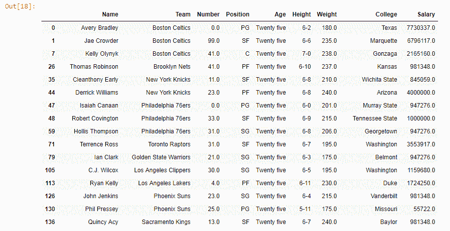
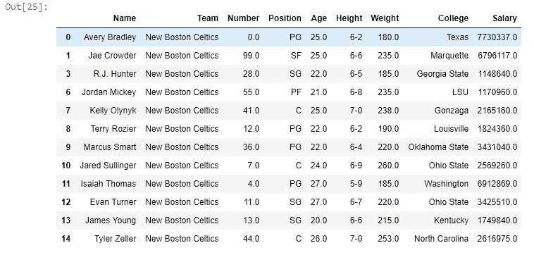

# Python | Pandas series . str . replace()替换系列中的文本

> 原文:[https://www . geesforgeks . org/python-pandas-series-str-replace-replace-text-in-a-series/](https://www.geeksforgeeks.org/python-pandas-series-str-replace-to-replace-text-in-a-series/)

Python 是进行数据分析的优秀语言，主要是因为以数据为中心的 Python 包的奇妙生态系统。 ***【熊猫】*** 就是那种让导入和分析数据变得容易得多的包之一。

熊猫 **`Series.str.replace()`** 法只和 Python **`[.replace()](https://www.geeksforgeeks.org/replace-in-python-to-replace-a-substring/)`** 法一样有效，但在 Series 上也有效。打电话之前。替换熊猫系列中的()。str 必须加上前缀，以便与 Python 的默认替换方法区分开来。

> **语法:** Series.str.replace(pat，repl，n=-1，case=None，regex=True)
> 
> **参数:**
> **pat:** 字符串或编译后的 regex 要被替换
> **repl:** 字符串或 callabe 要被替换而不是 pat
> **n:** 单个字符串中要进行的替换次数，默认值为-1，表示全部。
> **大小写:**取布尔值决定大小写。对于不区分大小写
> **正则表达式:**布尔值为假，如果为真，则假设传递的模式是正则表达式
> 
> **返回类型:**带替换文本值的序列

要下载代码中使用的 CSV，点击这里的[。](https://media.geeksforgeeks.org/wp-content/uploads/nba.csv)

在下面的例子中，使用的数据框包含了一些 NBA 球员的数据。任何操作前的数据框图像附在下面。


**示例#1:** 替换年龄列中的值

在本例中，使用 str.replace()
将年龄列中值为 25.0 的所有值替换为“二十五”，然后创建一个过滤器并将其传递到[中。where()](https://www.geeksforgeeks.org/python-pandas-dataframe-where/) 方法只显示年龄=“二十五”的行。

```
# importing pandas module 
import pandas as pd

# reading csv file from url
data = pd.read_csv("https://media.geeksforgeeks.org/wp-content/uploads/nba.csv")

# overwriting column with replaced value of age
data["Age"]= data["Age"].replace(25.0, "Twenty five")

# creating a filter for age column 
# where age = "Twenty five"
filter = data["Age"]=="Twenty five"

# printing only filtered columns
data.where(filter).dropna()
```

**输出:**
如输出图像所示，age 列中 age=25.0 的所有值都已被“二十五”替换。


**例 2:** 病例不敏感

在本例中，球队名称*波士顿凯尔特人队*被*新波士顿凯尔特人队*取代。在参数中，不是传递波士顿，而是传递波士顿(小写的“b”)，大小写设置为 False，这意味着不区分大小写。之后，只有球队名称为“新波士顿凯尔特人”的球队才会使用显示。where()方法。

```
# importing pandas module 
import pandas as pd

# reading csv file from url 
data = pd.read_csv("https://media.geeksforgeeks.org/wp-content/uploads/nba.csv")

# overwriting column with replaced value of age 
data["Team"]= data["Team"].str.replace("boston", "New Boston", case = False)

# creating a filter for age column 
# where age = "Twenty five" 
filter = data["Team"]=="New Boston Celtics"

# printing only filtered columns 
data.where(filter).dropna()
```

**输出:**
如输出图像所示，不管参数中传递的小写字母如何，波士顿都被新波士顿取代。这是因为 case 参数设置为 False。

