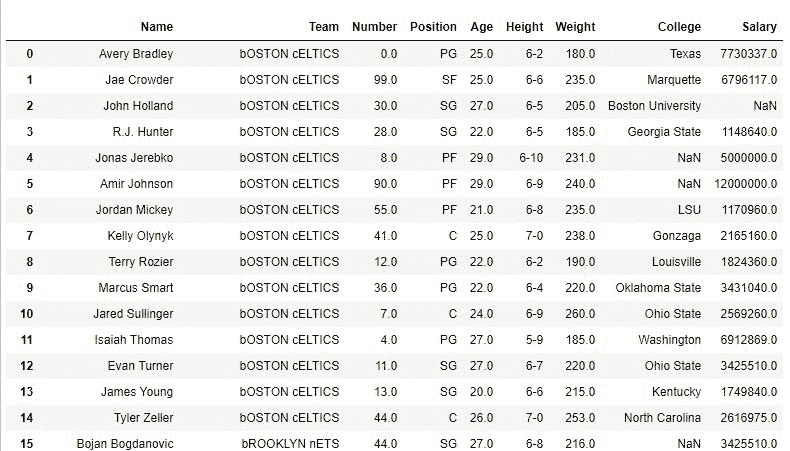

# Python | Pandas series . str . swapcase()

> 原文:[https://www . geesforgeks . org/python-pandas-series-str-swap base/](https://www.geeksforgeeks.org/python-pandas-series-str-swapcase/)

Python 是进行数据分析的优秀语言，主要是因为以数据为中心的 Python 包的奇妙生态系统。 ***【熊猫】*** 就是其中一个包，让导入和分析数据变得容易多了。

熊猫提供了一种方法来**交换一系列**中每个字符串的大小写。这意味着在每个字符串中，小写字符将被转换为大写，大写字符将被转换为小写。 ***。str*** 在每次调用这个方法之前都要加上前缀，以区别于 Python 的默认函数，否则会给出错误。

这种方法与熊猫的 [str.upper()](https://www.geeksforgeeks.org/python-pandas-series-str-lower-upper-and-title/) 和 [str.lower()](https://www.geeksforgeeks.org/python-pandas-series-str-lower-upper-and-title/) 相似。

> **语法:** Series.str.swapcase()
> 
> **返回类型:**每个字符大小写互换的系列

要下载代码中使用的 CSV，点击这里的[。](https://media.geeksforgeeks.org/wp-content/uploads/nba.csv)

在下面的例子中，使用的数据框包含了一些 NBA 球员的数据。可以看出，数据框中的文本大多是 Camel 的情况。在以下示例中，str.swapcase()方法将用于交换文本的大小写。任何操作前的数据帧图像如下所示:


**示例#1:**

在本例中，使用 [dropna()](https://www.geeksforgeeks.org/python-pandas-dataframe-dropna/) 方法删除空行(尽管 str.swapcase()不会为空值抛出错误，但删除它们以避免错误是一个很好的做法)。

之后，团队栏中文本的大小写被替换为使用。swapcase()方法，结果将在“团队”列中被覆盖。之后，将显示数据框，以查看在“团队”列的文本案例中所做的更改。

```py
# importing pandas module
import pandas as pd

# making data frame csv at url 
data = pd.read_csv("https://media.geeksforgeeks.org/wp-content/uploads/nba.csv")

# removing null values to avoid errors 
data.dropna(how ='all', inplace = True)

# using swapcase() to interchange case
data["Team"] = data["Team"].str.swapcase()

# display
data
```

**输出:**
如输出图所示，Team 列中的文字格已经互换。


**例 2:**

在此示例中，创建了“名称”列的副本。之后，在其上应用两次 str.swapcase()，并使用原始系列检查它是否相同。

```py
# importing pandas module
import pandas as pd

# making data frame csv at url
data = pd.read_csv("https://media.geeksforgeeks.org/wp-content/uploads/nba.csv")

# removing null values to avoid errors
data.dropna(how ='all', inplace = True)

# making copy of series
new = data["Team"].copy()

# using swapcase() twice to interchange case
data["Team"] = data["Team"].str.swapcase().str.swapcase()

# creating a filter
filter = new == data["Team"]

# displaying values only where text at new == data["Team"]
data.where(filter)
```

**输出:**
如输出图像所示，当过滤器被传入时，整个数据帧被返回。where()方法。这意味着在执行两次 str.swapcase()后，字符串将恢复到操作前的状态。
