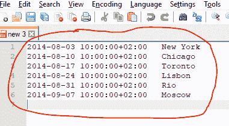
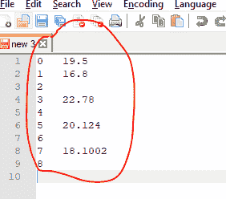

# Python | Pandas series . to _ clipboard()

> 原文:[https://www . geesforgeks . org/python-pandas-series-to _ clipboard/](https://www.geeksforgeeks.org/python-pandas-series-to_clipboard/)

熊猫系列是带有轴标签的一维数组。标签不必是唯一的，但必须是可散列的类型。该对象支持基于整数和基于标签的索引，并提供了一系列方法来执行涉及索引的操作。

熊猫 `**Series.to_clipboard()**`功能复制对象到系统剪贴板。它将对象的文本表示写入系统剪贴板。这也可以粘贴到 Excel 中。

> **语法:**series . to _ clipboard(excel = True，sep=None，**kwargs)
> 
> **参数:**
> **excel :** bool，缺省 True
> **sep :** str，缺省' \t'
> ****kwargs :** 这些参数将传递给 DataFrame.to_csv。
> 
> **返回:**无

**示例#1:** 使用`Series.to_clipboard()`功能将给定的序列对象复制到系统剪贴板。

```py
# importing pandas as pd
import pandas as pd

# Creating the Series
sr = pd.Series(['New York', 'Chicago', 'Toronto', 'Lisbon', 'Rio', 'Moscow'])

# Create the Datetime Index
didx = pd.DatetimeIndex(start ='2014-08-01 10:00', freq ='W', 
                     periods = 6, tz = 'Europe/Berlin') 

# set the index
sr.index = didx

# Print the series
print(sr)
```

**输出:**


现在我们将使用`Series.to_clipboard()`函数将给定的序列对象复制到系统剪贴板。

```py
# copy to clipboard
sr.to_clipboard()
```

**输出:**



在执行完最后一行代码后，我们只需将复制到系统剪贴板的内容粘贴到记事本++。这就是它的样子。

**示例 2:** 使用`Series.to_clipboard()`功能将给定的序列对象复制到系统剪贴板。

```py
# importing pandas as pd
import pandas as pd

# Creating the Series
sr = pd.Series([19.5, 16.8, None, 22.78, None, 20.124, None, 18.1002, None])

# Print the series
print(sr)
```

**输出:**


现在我们将使用`Series.to_clipboard()`函数将给定的序列对象复制到系统剪贴板。

```py
# copy to clipboard
sr.to_clipboard()
```

**输出:**



在执行完最后一行代码后，我们只需将复制到系统剪贴板的内容粘贴到记事本++。这就是它的样子。请注意缺少的值是如何表示为空白的。