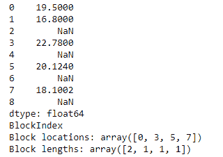

# Python | Pandas series . to _ sparse()

> 原文:[https://www . geesforgeks . org/python-pandas-series-to _ sparse/](https://www.geeksforgeeks.org/python-pandas-series-to_sparse/)

熊猫系列是带有轴标签的一维数组。标签不必是唯一的，但必须是可散列的类型。该对象支持基于整数和基于标签的索引，并提供了一系列方法来执行涉及索引的操作。

熊猫 `**Series.to_sparse()**`函数将给定的序列对象转换为稀疏数据集。稀疏对象基本上是压缩对象。如果系列对象中的一些数据丢失，那么这些位置将被稀疏化。存储丢失的值不会浪费内存。

> **语法:**series . to _ sparse(kind = ' block '，fill_value=None)
> 
> **参数:**
> **种类:** {'block '，' integer ' }
> **fill _ value:**float，默认为 NaN(缺失)
> 
> **返回:** sp:稀疏存储

**示例#1:** 使用`Series.to_sparse()`函数将给定的序列对象转换为稀疏存储对象。

```py
# importing pandas as pd
import pandas as pd

# Creating the Series
sr = pd.Series(['New York', 'Chicago', 'Toronto', 'Lisbon', 'Rio', 'Moscow'])

# Create the Datetime Index
didx = pd.DatetimeIndex(start ='2014-08-01 10:00', freq ='W', 
                     periods = 6, tz = 'Europe/Berlin') 

# set the index
sr.index = didx

# Print the series
print(sr)
```

**输出:**


现在我们将使用`Series.to_sparse()`函数来实现给定的 Series 对象到 SparseSeries 对象的转换。

```py
# convert to Sparse object
sr.to_sparse()
```

**输出:**


正如我们在输出中看到的，`Series.to_sparse()`函数已经成功地将给定的序列对象转换为稀疏对象。

**示例 2:** 使用`Series.to_sparse()`函数将给定的序列对象转换为稀疏存储对象。

```py
# importing pandas as pd
import pandas as pd

# Creating the Series
sr = pd.Series([19.5, 16.8, None, 22.78, None, 20.124, None, 18.1002, None])

# Print the series
print(sr)
```

**输出:**


现在我们将使用`Series.to_sparse()`函数来实现给定的 Series 对象到 SparseSeries 对象的转换。

```py
# convert to Sparse object
sr.to_sparse()
```

**输出:**



正如我们在输出中看到的那样，`Series.to_sparse()`函数已经成功地将给定的序列对象转换为稀疏对象。如果我们看下面两行，它已经返回了关于内存块位置和包含在这些块中的值的数量的信息。