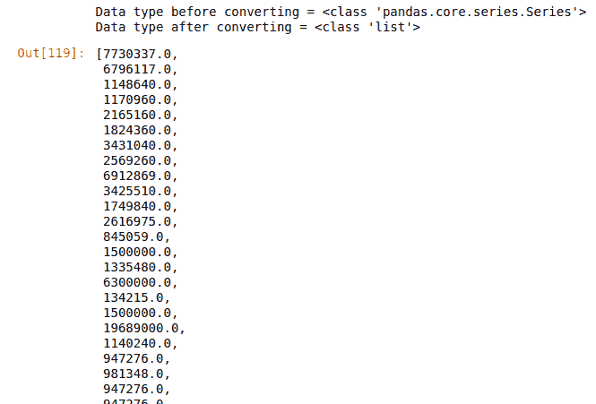

# 蟒蛇|熊猫系列. tolist()

> 原文:[https://www.geeksforgeeks.org/python-pandas-series-tolist/](https://www.geeksforgeeks.org/python-pandas-series-tolist/)

Python 是进行数据分析的优秀语言，主要是因为以数据为中心的 Python 包的奇妙生态系统。 ***【熊猫】*** 就是其中一个包，让导入和分析数据变得容易多了。

熊猫 **`tolist()`** 是用来把一个系列转换成列表的。最初该系列的类型为 pandas.core.series.Series，应用 tolist()方法，将其转换为 list 数据类型。

> **语法:** Series.tolist()
> 
> **返回类型:**转换成列表的系列

要下载下例使用的数据集，点击这里的[。](https://media.geeksforgeeks.org/wp-content/uploads/nba.csv)
在下面的例子中，使用的数据框包含了一些 NBA 球员的数据。任何操作前的数据框图像附在下面。


**示例:**
在本例中，Name 列的数据类型存储在一个变量中。之后，使用 tolist()方法转换数据，并再次存储和打印数据类型。

```py
# importing pandas module 
import pandas as pd 

# importing regex module
import re

# making data frame 
data = pd.read_csv("https://media.geeksforgeeks.org/wp-content/uploads/nba.csv") 

# removing null values to avoid errors 
data.dropna(inplace = True) 

# storing dtype before operation
dtype_before = type(data["Salary"])

# converting to list
salary_list = data["Salary"].tolist()

# storing dtype after operation
dtype_after = type(salary_list)

# printing dtype
print("Data type before converting = {}\nData type after converting = {}".format(dtype_before, dtype_after))

# displaying list
salary_list
```

**输出:**
如输出图像所示，数据类型从序列转换为列表。薪资列表的输出是列表格式。
