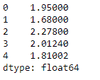
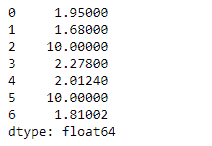

# Python | Pandas series . truediv()

> 原文:[https://www.geeksforgeeks.org/python-pandas-series-truediv/](https://www.geeksforgeeks.org/python-pandas-series-truediv/)

熊猫系列是带有轴标签的一维数组。标签不必是唯一的，但必须是可散列的类型。该对象支持基于整数和基于标签的索引，并提供了一系列方法来执行涉及索引的操作。

熊猫 `**Series.truediv()**`函数执行数列和其他元素的浮点除法(二进制运算符 truediv)。它相当于`series / other`，但支持用 fill_value 替换其中一个输入中缺失的数据。

> **语法:** Series.truediv(其他，级别=无，fill _ value =无，轴=0)
> 
> **参数:**
> **其他:**系列或标量值
> **fill_value :** 填充现有缺失(NaN)值
> **级别:**跨级别广播，在传递的多索引级别上匹配索引值
> 
> **返回:**结果:系列

**示例#1:** 使用`Series.truediv()`函数执行给定序列对象与其他标量的浮点除法。

```
# importing pandas as pd
import pandas as pd

# Creating the Series
sr = pd.Series([19.5, 16.8, 22.78, 20.124, 18.1002])

# Print the series
print(sr)
```

**输出:**


现在我们将使用`Series.truediv()`函数来执行给定序列对象与其他标量的浮点除法。

```
# divide all elements of the series by 10
sr.truediv(other = 10)
```

**输出:**



正如我们在输出中看到的那样，`Series.truediv()`函数已经成功地对给定的 Series 对象执行了元素分割。

**示例#1:** 使用`Series.truediv()`函数执行给定序列对象与其他标量的浮点除法。给定的 Series 对象包含一些缺失的值。处理缺少的值。

```
# importing pandas as pd
import pandas as pd

# Creating the Series
sr = pd.Series([19.5, 16.8, None, 22.78, 20.124, None, 18.1002])

# Print the series
print(sr)
```

**输出:**


现在我们将使用`Series.truediv()`函数来执行给定序列对象与其他标量的浮点除法。将缺少的值填充 100。

```
# divide all elements of the series by 10
# Also fill all the missing places by 100
sr.truediv(other = 10, fill_value = 100)
```

**输出:**



正如我们在输出中看到的那样，`Series.truediv()`函数已经成功地对给定的 Series 对象执行了元素分割。在执行除法之前，它还在缺少值的地方替换了 100。