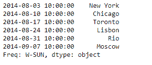
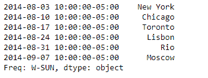

# 蟒蛇|熊猫系列. tz_localize

> 原文:[https://www . geesforgeks . org/python-pandas-series-tz _ local/](https://www.geeksforgeeks.org/python-pandas-series-tz_localize/)

Python 是进行数据分析的优秀语言，主要是因为以数据为中心的 python 包的奇妙生态系统。 ***【熊猫】*** 就是其中一个包，让导入和分析数据变得容易多了。

熊猫系列是带有轴标签的一维数组。标签不必是唯一的，但必须是可散列的类型。该对象支持基于整数和基于标签的索引，并提供了一系列方法来执行涉及索引的操作。

熊猫 `**Series.tz_localize()**`功能用于将系列或数据帧的原始索引定位到目标时区。此操作将索引本地化。为了本地化时区未知系列中的值，我们可以使用 Series.dt.tz_localize()。

> **语法:** Series.tz_localize(tz，轴=0，级别=无，复制=真，不明确= '提升'，不存在= '提升')
> 
> **参数:**
> **tz :** 字符串或 pytz.timezone 对象
> **轴:**要本地化的轴
> **级别:**如果轴是一个 MultiIndex，则本地化一个特定级别。否则必须为 None
> **copy :** 同时复制底层数据
> **模棱两可:**【推断】，bool-n array，【NaT】，默认“rail”
> **不存在:** str，默认“rail”
> 
> **返回:**序列或数据帧

**示例#1:** 使用`Series.tz_localize()`函数将给定系列的时区初始索引定位到目标时区。

```py
# importing pandas as pd
import pandas as pd

# Creating the Series
sr = pd.Series(['New York', 'Chicago', 'Toronto', 'Lisbon', 'Rio', 'Moscow'])

# Create the Datetime Index
didx = pd.DatetimeIndex(start ='2014-08-01 10:00', freq ='W', 
                                                 periods = 6) 

# set the index
sr.index = didx

# Print the series
print(sr)
```

**输出:**


现在我们将使用`Series.tz_localize()`函数将给定的时区初始索引定位到时区感知索引。目标时区为“美国/中部”。

```py
# Localize to 'US / Central'
sr.tz_localize('US/Central')
```

**输出:**

正如我们在输出中看到的，`Series.tz_localize()`函数已经将给定的幼稚时区索引转换为时间感知索引。

**示例 2:** 使用`Series.tz_localize()`函数将给定序列的时区初始索引定位到目标时区。

```py
# importing pandas as pd
import pandas as pd

# Creating the Series
sr = pd.Series([19.5, 16.8, 22.78, 20.124, 18.1002])

# Create the Datetime Index
didx = pd.DatetimeIndex(start ='2014-08-01 10:00', freq ='W', 
                                                 periods = 5) 

# set the index
sr.index = didx

# Print the series
print(sr)
```

**输出:**


现在我们将使用`Series.tz_localize()`函数将给定的时区初始索引定位到时区感知索引。目标时区是“亚洲/加尔各答”。

```py
# Localize to 'Asia/Calcutta'
sr.tz_localize('Asia/Calcutta')
```

**输出:**
