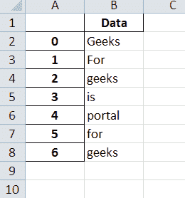
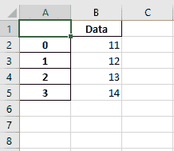
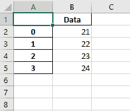
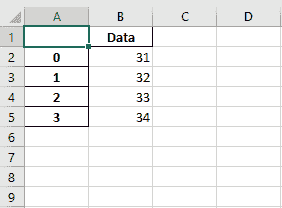
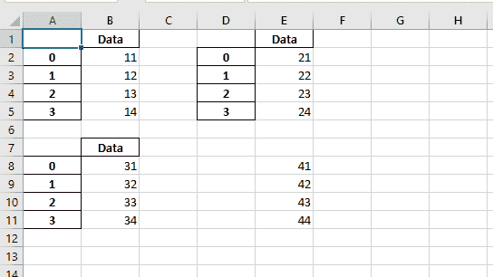

# Python |与熊猫和 XlsxWriter 合作| Set–1

> 原文:[https://www . geesforgeks . org/python-与熊猫合作-and-xlsxwriter-set-1/](https://www.geeksforgeeks.org/python-working-with-pandas-and-xlsxwriter-set-1/)

Python Pandas 是一个数据分析库。它可以读取、过滤和重新排列大小数据集，并以包括 Excel 在内的一系列格式输出它们。

**熊猫**使用 XlsxWriter 模块编写 Excel 文件。

**`XlsxWriter`** 是一个 Python 模块，用于以`XLSX` 文件格式编写文件。它可用于将文本、数字和公式写入多个工作表。此外，它还支持格式、图像、图表、页面设置、自动过滤器、条件格式等功能。

**代码#1:** 使用 Pandas 和 XlsxWriter 将 Pandas 数据帧转换为 xlsx 文件。

```
# import pandas as pd
import pandas as pd

# Create a Pandas dataframe from some data.
df = pd.DataFrame({'Data': ['Geeks', 'For', 'geeks', 'is',
                               'portal', 'for', 'geeks']})

# Create a Pandas Excel writer
# object using XlsxWriter as the engine.
writer = pd.ExcelWriter('pandasEx.xlsx', 
                   engine ='xlsxwriter')

# Write a dataframe to the worksheet.
df.to_excel(writer, sheet_name ='Sheet1')

# Close the Pandas Excel writer
# object and output the Excel file.
writer.save()
```

**输出:**


**代码#2:** 使用 Pandas 和 XlsxWriter 将多个数据框写入工作表。

```
# import pandas as pd
import pandas as pd

# Create some Pandas dataframes from some data.
df1 = pd.DataFrame({'Data': [11, 12, 13, 14]})
df2 = pd.DataFrame({'Data': [21, 22, 23, 24]})
df3 = pd.DataFrame({'Data': [31, 32, 33, 34]})

# Create a Pandas Excel writer object 
# using XlsxWriter as the engine.
writer = pd.ExcelWriter('pandas_multiple.xlsx', 
                          engine ='xlsxwriter')

# Write each dataframe to a different worksheet.
df1.to_excel(writer, sheet_name ='Sheet1')
df2.to_excel(writer, sheet_name ='Sheet2')
df3.to_excel(writer, sheet_name ='Sheet3')

# Close the Pandas Excel writer object
# and output the Excel file.
writer.save()
```

**输出:**
  

**代码#3:** 使用 Pandas 和 XlsxWriter 在工作表中定位数据框。

```
# import pandas as pd
import pandas as pd

# Create some Pandas dataframes from some data.
df1 = pd.DataFrame({'Data': [11, 12, 13, 14]})
df2 = pd.DataFrame({'Data': [21, 22, 23, 24]})
df3 = pd.DataFrame({'Data': [31, 32, 33, 34]})
df4 = pd.DataFrame({'Data': [41, 42, 43, 44]})

# Create a Pandas Excel writer object
# using XlsxWriter as the engine.
writer = pd.ExcelWriter('pandas_positioning.xlsx', 
                             engine ='xlsxwriter')

# write and Positioning the dataframes in the worksheet.
# Default position, cell A1.
df1.to_excel(writer, sheet_name ='Sheet1')  
df2.to_excel(writer, sheet_name ='Sheet1', startcol = 3)
df3.to_excel(writer, sheet_name ='Sheet1', startrow = 6)

# It is also possible to write the
# dataframe without the header and index.
df4.to_excel(writer, sheet_name ='Sheet1',
             startrow = 7, startcol = 4,
             header = False, index = False)

# Close the Pandas Excel writer object
# and output the Excel file.
writer.save()
```

**输出:**
