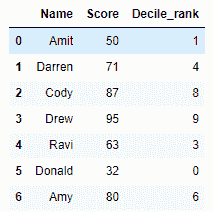

# 熊猫-Python 中一列的分位数和十分位数

> 原文:[https://www . geeksforgeeks . org/分位数和十分位数-熊猫一栏排名-python/](https://www.geeksforgeeks.org/quantile-and-decile-rank-of-a-column-in-pandas-python/)

让我们看看如何在熊猫中找到一个列的分位数和十分位数。我们将使用`pandas`模块的`qcut()`功能。

## 熊猫

熊猫库的函数`**qcut()**`是一个基于分位数的离散化函数。这意味着它根据等级或样本分位数将变量离散成大小相等的桶。

> **语法:** pandas.qcut(x，q，labels=None，retbins: bool = False，precision: int = 3，duplicates: str = 'raise ')
> 
> **参数:**
> 
> *   **x :** 1d 数组或系列。
> *   **q :** 分位数。例如，10 指十分位数，4 指分位数。
> *   **标签:**用作结果箱的标签。如果设置为假，它只返回容器的整数指示符。如果为真，则引发错误。默认情况下，它设置为“无”。
> *   **retbin:**(可选)它是一个布尔值，当设置为真时返回(bin，标签)。
> *   **精度:**(可选)存储和显示箱柜标签的精度。
> *   **重复:**(可选)如果箱边不唯一，则增加值错误或删除非唯一。

## 分位数等级

**算法:**

1.  导入`pandas` 和`numpy` 模块。
2.  创建数据帧。
3.  使用`pandas.qcut()`函数，传递`Score`列，计算分位数离散化。并且`q`被设置为 4，因此这些值是从 0-3 分配的
4.  打印带有分位数等级的数据帧。

```py
# importing the modules
import pandas as pd
import numpy as np

# creating a DataFrame
df = {'Name' : ['Amit', 'Darren', 'Cody', 'Drew',
                'Ravi', 'Donald', 'Amy'],
      'Score' : [50, 71, 87, 95, 63, 32, 80]}
df = pd.DataFrame(df, columns = ['Name', 'Score'])

# adding Quantile_rank column to the DataFrame
df['Quantile_rank'] = pd.qcut(df['Score'], 4,
                               labels = False)

# printing the DataFrame
print(df)
```

**输出:**


## 十分位数

**算法:**

1.  导入`pandas` 和`numpy` 模块。
2.  创建数据帧。
3.  使用`pandas.qcut()`函数，传递`Score`列，计算分位数离散化。`q`被设置为 10，因此数值从 0-9 分配
4.  以十分位数打印数据帧。

```py
# importing the modules
import pandas as pd
import numpy as np

# creating a DataFrame
df = {'Name' : ['Amit', 'Darren', 'Cody', 'Drew',
                'Ravi', 'Donald', 'Amy'],
      'Score' : [50, 71, 87, 95, 63, 32, 80]}
df = pd.DataFrame(df, columns = ['Name', 'Score'])

# adding Decile_rank column to the DataFrame
df['Decile_rank'] = pd.qcut(df['Score'], 10,
                            labels = False)

# printing the DataFrame
print(df)
```

**输出:**
