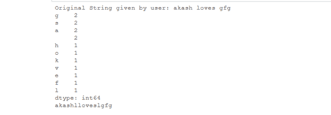

# 使用 Pandas

替换字符串中缺少的最不频繁的空格

> 原文:[https://www . geesforgeks . org/replace-missing-white-spaces-in-a-string-with-frequency-use-pandas/](https://www.geeksforgeeks.org/replace-missing-white-spaces-in-a-string-with-the-least-frequent-character-using-pandas/)

让我们用 python 创建一个程序，使用 Pandas 库将字符串中的空格
替换为字符串中最少出现的字符
。

**例 1:**

```py
String S = "akash loves gfg" 
here:
'g' comes: 2 times
's' comes: 2 times
'a' comes: 2 times
'h' comes: 1 time 
'o' comes: 1 time 
'k' comes: 1 time 
'v' comes: 1 time 
'e' comes: 1 time 
'f' comes: 1 time 
'l' comes: 1 time 

In this example, there are 7 characters with least frequency 1 so, there can be
7 valid outputs One of the possible output is given below: 
So, the Output String will be: "akashlloveslgfg".
```

**例 2:**

```py
string ="goodd noon" 
here:
g comes: 1 time 
o comes: 4 times 
d comes: 2 times 
n comes: 2 times 
So the character with the least frequency 1 is g So here white spaces will be 
replaced by the character g and the output will be: 
"gooddgnoon" 
```

现在，让我们看看实现:

## 蟒蛇 3

```py
# importing pandas library
import pandas as pd

# taking string with white spaces
newstr1 = 'akash loves gfg'

# printing the original string
print("Original String given by user:",
      newstr1)

# converting string into
# list of characters
ser = pd.Series(list(newstr1))

# counting the frequency
# of characters
element_freq = ser.value_counts()

# printing character and their
# respective frequency
print(element_freq)

current_freq = element_freq.dropna().index[-1]

# function element_freq.dropna()
# will  Return a new Series with
# missing values removed
result = "".join(ser.replace(' ',
                             current_freq))

print(result)
```

**输出:**

