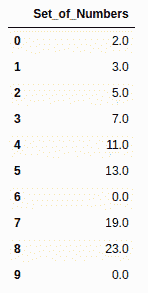
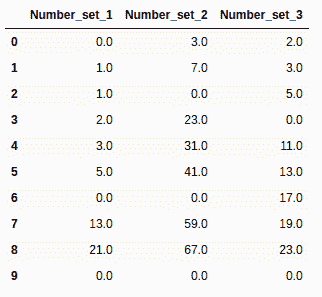
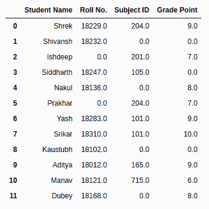

# 在熊猫数据框中用零替换 NaN 值

> 原文:[https://www . geesforgeks . org/replace-nan-values-with-zero-in-pandas-data frame/](https://www.geeksforgeeks.org/replace-nan-values-with-zeros-in-pandas-dataframe/)

NaN 代表 Not A Number，是表示数据中缺失值的常用方法之一。它是一个特殊的浮点值，不能转换为除浮点以外的任何其他类型。NaN 值是数据分析中的主要问题之一。为了得到预期的结果，与 NaN 打交道是非常必要的。


**熊猫数据框中用零替换 NaN 值的方法:**

*   **fillna()**
    功能用于使用指定的方法填充 NA/NaN 值。
*   **replace()**
    Pandas 中的`dataframe.replace()`函数可以定义为一个简单的方法，用来替换字符串、正则表达式、列表、字典等。在数据帧中。

**替换 NaN 值的步骤:**

*   使用熊猫的一栏:

    ```py
    df['DataFrame Column'] = df['DataFrame Column'].fillna(0)

    ```

*   对于使用 numpy 的一列:

    ```py
    df['DataFrame Column'] = df['DataFrame Column'].replace(np.nan, 0)

    ```

*   对于使用熊猫的整个数据帧:

    ```py
    df.fillna(0)

    ```

*   对于整个数据帧，使用 numpy:

    ```py
    df.replace(np.nan, 0)

    ```

**方法 1:对单个列使用 fillna()函数**

**示例:**

```py
# importing libraries
import pandas as pd
import numpy as np

nums = {'Set_of_Numbers': [2, 3, 5, 7, 11, 13, 
                           np.nan, 19, 23, np.nan]}

# Create the dataframe
df = pd.DataFrame(nums, columns =['Set_of_Numbers'])

# Apply the function
df['Set_of_Numbers'] = df['Set_of_Numbers'].fillna(0)

# print the DataFrame
df
```

**输出:**



#### 方法 2:对单个列使用 replace()函数

**示例:**

```py
# importing libraries
import pandas as pd
import numpy as np

nums = {'Car Model Number': [223, np.nan, 237, 195, np.nan,
                             575, 110, 313, np.nan, 190, 143, 
                             np.nan],
       'Engine Number': [4511, np.nan, 7570, 1565, 1450, 3786, 
                         2995, 5345, 7777, 2323, 2785, 1120]}

# Create the dataframe
df = pd.DataFrame(nums, columns =['Car Model Number'])

# Apply the function
df['Car Model Number'] = df['Car Model Number'].replace(np.nan, 0)

# print the DataFrame
df
```

**输出:**


#### 方法 3:对整个数据帧使用 fillna()函数

**示例:**

```py
# importing libraries
import pandas as pd
import numpy as np

nums = {'Number_set_1': [0, 1, 1, 2, 3, 5, np.nan,
                         13, 21, np.nan],
       'Number_set_2': [3, 7, np.nan, 23, 31, 41, 
                        np.nan, 59, 67, np.nan],
       'Number_set_3': [2, 3, 5, np.nan, 11, 13, 17,
                        19, 23, np.nan]}

# Create the dataframe
df = pd.DataFrame(nums)

# Apply the function
df = df.fillna(0)

# print the DataFrame
df
```

**输出:**



#### 方法 4:对整个数据帧使用 replace()函数

**示例:**

```py
# importing libraries
import pandas as pd
import numpy as np

nums = {'Student Name': [ 'Shrek', 'Shivansh', 'Ishdeep',  
                         'Siddharth', 'Nakul', 'Prakhar',
                         'Yash', 'Srikar', 'Kaustubh', 
                         'Aditya',  'Manav', 'Dubey'],
        'Roll No.': [ 18229, 18232, np.nan, 18247, 18136, 
                     np.nan, 18283, 18310, 18102, 18012,
                     18121, 18168],
        'Subject ID': [204, np.nan, 201, 105, np.nan, 204,
                       101, 101, np.nan, 165, 715, np.nan],
       'Grade Point': [9, np.nan, 7, np.nan, 8, 7, 9, 10,
                       np.nan, 9, 6, 8]}

# Create the dataframe
df = pd.DataFrame(nums)

# Apply the function
df = df.replace(np.nan, 0)

# print the DataFrame
df
```

**输出:**

