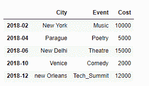
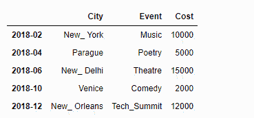
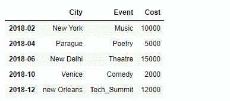

# 使用正则表达式

替换熊猫数据框中的值

> 原文:[https://www . geesforgeks . org/replace-values-in-pandas-data frame-use-regex/](https://www.geeksforgeeks.org/replace-values-in-pandas-dataframe-using-regex/)

在处理大量数据时，它通常包含文本数据，在许多情况下，这些文本一点也不漂亮。通常是非常混乱的形式，我们需要清理这些数据，然后才能对这些文本数据做任何有意义的事情。大多数情况下，文本语料库是如此之大，以至于我们无法手动列出所有我们想要替换的文本。所以在这种情况下，我们使用正则表达式来处理这种带有某种模式的数据。

我们在之前的文章[中已经讨论过如何替换数据框](https://www.geeksforgeeks.org/python-pandas-series-str-replace-to-replace-text-in-a-series/)中的一些已知字符串值。在这篇文章中，我们将使用正则表达式来替换具有某种模式的字符串。

**问题#1 :** 给你一个包含不同城市各种事件细节的数据框架。对于以关键字“新”或“新”开头的城市，将其更改为“新 _”。

**解决方案:**我们将使用正则表达式来检测这些名称，然后我们将使用`Dataframe.replace()`函数来替换这些名称。

```
# importing pandas as pd
import pandas as pd

# Let's create a Dataframe
df = pd.DataFrame({'City':['New York', 'Parague', 'New Delhi', 'Venice', 'new Orleans'],
                    'Event':['Music', 'Poetry', 'Theatre', 'Comedy', 'Tech_Summit'],
                    'Cost':[10000, 5000, 15000, 2000, 12000]})

# Let's create the index
index_ = [pd.Period('02-2018'), pd.Period('04-2018'),
          pd.Period('06-2018'), pd.Period('10-2018'), pd.Period('12-2018')]

# Set the index
df.index = index_

# Let's print the dataframe
print(df)
```

**输出:**


现在我们将编写正则表达式来匹配字符串，然后我们将使用`Dataframe.replace()`函数来替换那些名称。

```
# replace the matching strings
df_updated = df.replace(to_replace ='[nN]ew', value = 'New_', regex = True)

# Print the updated dataframe
print(df_updated)
```

**输出:**

在输出中我们可以看到，旧的字符串已经被新的字符串成功替换。

**问题 2 :** 给你一个包含不同城市各种事件细节的数据框架。某些城市的名称包含一些附加的细节，用括号括起来。搜索此类名称并删除其他详细信息。

**解决方案:**对于这个任务，我们将使用正则表达式编写自己的定制函数来识别和更新那些城市的名称。此外，我们将使用`Dataframe.apply()`函数对列中的每个值应用我们定制的函数。

```
# importing pandas as pd
import pandas as pd

# Let's create a Dataframe
df = pd.DataFrame({'City':['New York (City)', 'Parague', 'New Delhi (Delhi)', 'Venice', 'new Orleans'],
                    'Event':['Music', 'Poetry', 'Theatre', 'Comedy', 'Tech_Summit'],
                    'Cost':[10000, 5000, 15000, 2000, 12000]})

# Let's create the index
index_ = [pd.Period('02-2018'), pd.Period('04-2018'),
          pd.Period('06-2018'), pd.Period('10-2018'), pd.Period('12-2018')]

# Set the index
df.index = index_

# Let's print the dataframe
print(df)
```

**输出:**


现在我们将编写自己的定制函数来匹配城市名称中的描述。

```
# Importing re package for using regular expressions
import re

# Function to clean the names
def Clean_names(City_name):
    # Search for opening bracket in the name followed by
    # any characters repeated any number of times
    if re.search('\(.*', City_name):

        # Extract the position of beginning of pattern
        pos = re.search('\(.*', City_name).start()

        # return the cleaned name
        return City_name[:pos]

    else:
        # if clean up needed return the same name
        return City_name

# Updated the city columns
df['City'] = df['City'].apply(Clean_names)

# Print the updated dataframe
print(df)
```

**输出:**
