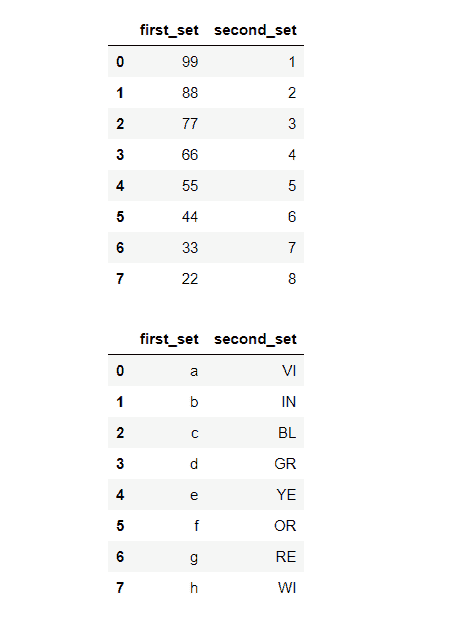
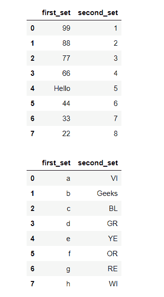
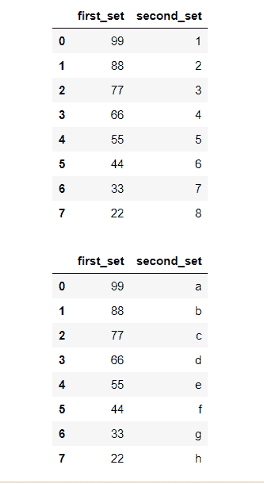
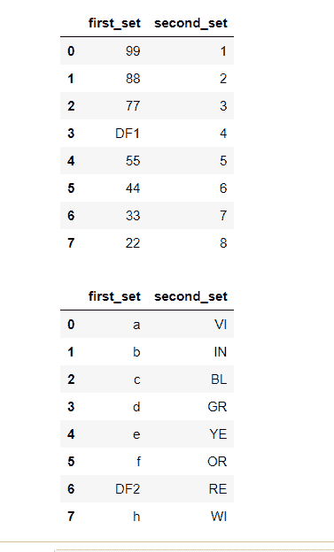
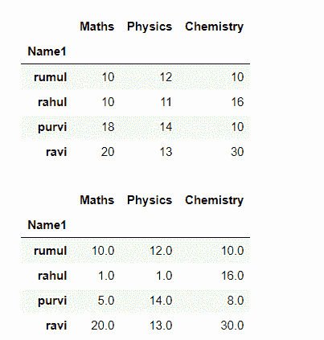

# 用熊猫中另一个数据帧的值替换一个数据帧的值

> 原文:[https://www . geesforgeks . org/将数据框的值替换为熊猫中另一个数据框的值/](https://www.geeksforgeeks.org/replace-values-of-a-dataframe-with-the-value-of-another-dataframe-in-pandas/)

在本文中，我们将学习如何使用熊猫用另一个数据帧的值替换一个数据帧的值。

可以使用[**data frame . replace()**](https://www.geeksforgeeks.org/python-pandas-dataframe-replace/)方法完成。它用于替换正则表达式、字符串、列表、序列、数字、字典等。从数据框中，数据框方法的值被动态替换为另一个值。这是一个非常丰富的功能，因为它有很多方法。本教程解释了如何在实践中使用这些方法的不同示例。

> **语法:**数据帧.替换(旧值，新值)
> 
> **参数:**
> 
> *   **旧值:**这是要替换的旧子串。
> *   **新值:**这是新的子串，将替换旧的子串。

### 例子

在这里，我们将创建一些数据，用于进一步的示例。

## 蟒蛇 3

```py
import pandas as pd

# initialise data of lists.
colors = {'first_set':  ['99', '88', '77', '66',
                         '55', '44', '33', '22'],
          'second_set': ['1', '2', '3', '4', '5',
                         '6', '7', '8']
          }

color = {'first_set':  ['a', 'b', 'c', 'd', 'e',
                        'f', 'g', 'h'],
         'second_set': ['VI', 'IN', 'BL', 'GR',
                        'YE', 'OR', 'RE', 'WI']
         }
# Calling DataFrame constructor on list
df = pd.DataFrame(colors, columns=['first_set', 'second_set'])
df1 = pd.DataFrame(color, columns=['first_set', 'second_set'])

# Display the Output
display(df)
display(df1)
```

**输出:**



**示例 1:** 将数据帧的 first_set 的“e”值替换为“88”值。

## 蟒蛇 3

```py
# selecting old value
a = df1['first_set'][4]

# selecting new value
b = df['first_set'][1]

# replace values of one DataFrame
# with the value of another DataFrame
df1 = df1.replace(a,b)

# Display the Output
display(df1)
```

**输出:**


**示例 2:** 将数据帧的 first _ setof 的“55”值替换为“b”值。

## 蟒蛇 3

```py
# Display the Output
display(df)
display(df1)

# Selecting old value
a = df['first_set'][4]

# Selecting new value
b = df1['first_set'][1]

# replace values of one DataFrame with
# the value of another DataFrame
df = df.replace(a,b)

# Display the Output
display(df)
```

**输出:**


**示例 3:** 现在让我们将数据帧的“first_set”列下的“55”值替换为“Hello”值，将“VI”值替换为“Geeks”值。

## 蟒蛇 3

```py
#selected value
a = df['first_set'][4]
b = df1['second_set'][1]

# replace values of one DataFrame with
# the value of another DataFrame
df = df.replace(a,'Hello')

# replace values of one DataFrame with
# the value of another DataFrame
df1 = df1.replace(b,'Geeks')

display (df)
display(df1)
```

**输出:**



**示例 4:** 现在让我们用另一个数据帧的列替换一个数据帧的整列。

## 蟒蛇 3

```py
# replace column of one DataFrame with
# the column of another DataFrame
df['second_set'] = df1.replace(df['first_set'],df['second_set'])

display(df)
```

**输出:**



**例 5:** 这里，**df1 . first_set[df1 . first _ set = = ' 66 ']= ' DF1 '**的意思是首先我们在 DF1 的 first _ set 中找到' 66 '，之后我们在相同的位置用' DF1 '替换那个值(' 66 ')。

## 蟒蛇 3

```py
# replaceing value of DataFrame
df1.first_set[df1.first_set == '66'] = 'DF1'
df2.first_set[df2.first_set == 'g'] = 'DF2'

# display updated table
display(df1)
display(df2)
```

**输出:**



**示例 6:** 在本例中，我们创建了另一个数据帧‘df2’和‘df3’来替换‘df1’的值。这里“df2”“df3”的值将通过更新方法传递，然后它将找到“df1”中存在的匹配实体，在找到之后，它将用“df2”“df3”值更新该值。函数的作用是:更新给定 Series 对象中传递的索引所标识的值。

> **语法:** df.update(其他)
> 
> **参数:**
> 
> *   其他:系列

## 蟒蛇 3

```py
import pandas as pd

# Creating dataframe
df1 = pd.DataFrame([["rumul", 10, 12, 10],
                    ["rahul", 10, 11, 16],
                    ["purvi", 18, 14, 10],
                    ["ravi", 20, 13, 30]],
                   columns=["Name1", "Maths",
                            "Physics",
                            "Chemistry"])

# setting name1 as index column
df1 = df1.set_index('Name1')

display(df1)

# Creating another dataframe for
# replacement
df2 = pd.DataFrame(
  [["rahul", 1, 1]],
  columns=["Name2", "Maths", "Physics"])

df3 = pd.DataFrame(
  [["purvi", 5, 8]],
  columns=["Name3", "Maths", "Chemistry"])

# setting name2 and name3 as
# index column
df2 = df2.set_index('Name2')
df3 = df3.set_index('Name3')

# update the values at the
# passed index
df1.update(df2)
df1.update(df3)

display(df1)
```

**输出:**



**示例 7:** 使用 **isin** 方法过滤 df 并分配所需的行值。在这里，我们选择了常用的“名称”来过滤掉数据帧(df1)和数据帧(df2)中的数据，然后用“df2”的值替换它。例如，rumul 标记被替换为 5 到 18 个标记，rahul 标记被替换为 20 到 19 个标记，等等。Pandas isin()方法用于过滤数据帧。此方法有助于选择在特定列中具有特定值的行。

> **语法:** DataFrame.isin(值)
> 
> **参数:**
> 
> *   值:可迭代、序列、列表、元组、数据帧或字典。

## 蟒蛇 3

```py
import pandas as pd

# Creating dataframe
df1 = pd.DataFrame({'Name': ['rumul', 'rahul',
                             'ravi', 'imran'],
                    'Marks': [5, 20, 8, 12]})

df2 = pd.DataFrame({'Name': ['rumul', 'rahul',
                             'purvi', 'ravi',
                             'imran'],
                    'Marks': [18, 19, 13, 11, 15]})

display(df1)
display(df2)

# replace values of one DataFrame with
# the value of another DataFrame
df1['Marks'] = df2[df2['Name'].isin(df1['Name'])]['Marks'].values

display(df1)
```

**输出:**

