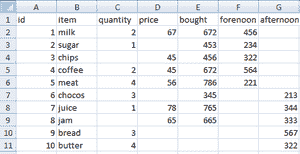
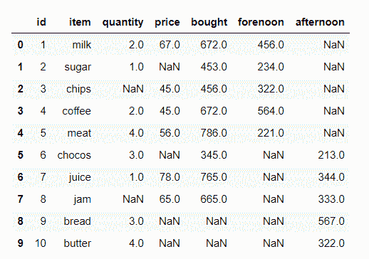
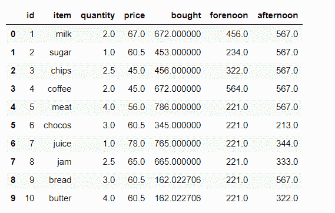

# 使用 Python 中的熊猫替换缺失值

> 原文:[https://www . geesforgeks . org/replacing-missing-values-use-pandas-in-python/](https://www.geeksforgeeks.org/replacing-missing-values-using-pandas-in-python/)

数据集是属性和行的集合。数据集可能有缺失的数据，这些数据在 Python 中用 NA 表示，在本文中，我们将替换本文中缺失的值

我们考虑这个数据集:[数据集](https://drive.google.com/drive/u/0/folders/1vUXily8GPnKx9nRb2HhibVtGrKQ8xYEt)



资料组

在我们的数据中，在数量、价格、购买量、上午和下午列中包含缺失值，

因此，我们可以用平均值替换数量列中的缺失值，用中位数替换价格列，用标准差替换买入列。带最小值的列。下午一列，最大值在该列。

**进场:**

*   导入模块
*   加载数据集
*   填写缺少的值
*   验证数据集

**语法:**

> **均值:** data=data.fillna(data.mean())
> 
> **中位数:** data=data.fillna(data .中位数())
> 
> **标准偏差:**数据=data.fillna(data.std())
> 
> **Min:**data = data . fill na(data . Min())
> 
> **Max:**data = data . fill na(data . Max())

以下是实施情况:

## 蟒蛇 3

```
# importing pandas module
import pandas as pd

# loading data set
data = pd.read_csv('item.csv')

# display the data
print(data)
```

**输出:**



然后，我们将继续用平均值、中值、模式、标准偏差、最小值和最大值替换缺失值

## 蟒蛇 3

```
# replacing missing values in quantity
# column with mean of that column
data['quantity'] = data['quantity'].fillna(data['quantity'].mean())

# replacing missing values in price column
# with median of that column
data['price'] = data['price'].fillna(data['price'].median())

# replacing missing values in bought column with
# standard deviation of that column
data['bought'] = data['bought'].fillna(data['bought'].std())

# replacing missing values in forenoon  column with
# minimum number of that column
data['forenoon'] = data['forenoon'].fillna(data['forenoon'].min())

# replacing missing values in afternoon  column with 
# maximum number of that column
data['afternoon'] = data['afternoon'].fillna(data['afternoon'].max())

print(Data)
```

**输出:**

