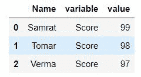

# 使用熊猫融化将宽数据框重塑为整齐的标识符

> 原文:[https://www . geeksforgeeks . org/resform-wide-data frame-to-stitch-with-identifier-use-pandas-melt/](https://www.geeksforgeeks.org/reshape-wide-dataframe-to-tidy-with-identifiers-using-pandas-melt/)

有时我们需要重塑熊猫的数据框架，以更好的方式进行分析。重塑在数据分析中起着至关重要的作用。熊猫提供了像融化和融化这样的重塑功能。在这篇文章中，我们将看到什么是熊猫融化，以及如何使用它来重塑宽到整齐的标识符。

**Pandas Melt():**Pandas . Melt()将数据帧从宽格式取消固定为长格式。Pandas melt()功能用于将数据框设计从宽改为长。它用于对数据帧对象进行特定配置，其中至少有一个段作为标识符填充。其余所有部分都被视为质量，并取消固定到线轴和只有两个部分，变量和价值。

> **语法:**pandas . melt(column _ level =无，variable _ name =无，Value_name='value '，value _ vars =无，id _ vars =无，frame)
> 
> **参数:**
> 
> *   **帧**:数据帧
> *   **id _ vars[元组、列表或数组，可选]** :用作标识符变量的列。
> *   **value _ vars[元组、列表或数组，可选]** :要取消固定的列。如果未指定，将使用所有未设置为 id_vars 的列。
> *   **var _ Name[标量]** :用于“变量”列的名称。如果没有，则使用 frame.columns.name 或“variable”。
> *   **value _ Name[标量，默认‘值’]**:用于‘值’列的名称。
> *   **col_level[int 或 string，可选]** :如果列是多索引，则使用该级别进行熔化。

**例 1:**

## 蟒蛇 3

```
# Load the libraries
import numpy as np
import pandas as pd
from scipy.stats import poisson

# We will use scipy.stats to create
# random numbers from Poisson distribution.
np.random.seed(seed = 128)
p1 = poisson.rvs(mu = 10, size = 3)
p2 = poisson.rvs(mu = 15, size = 3)
p3 = poisson.rvs(mu = 20, size = 3)

# Declaring the dataframe
data = pd.DataFrame({"P1":p1,
                 "P2":p2,
                 "P3":p3})

# Dataframe
print(" Wide Dataframe")
display(data)

data.melt()

# Change the names of the columns
data.melt(var_name = ["Sample"]).head()

# Specify a name for the values
print("\n Tidy Dataframe")
data.melt(var_name = "Sample",
          value_name = "Count").head()
```

**输出:**


**说明:**在本例中，我们使用泊松分布创建了三个数据集，并使用熊猫创建了一个数据框。然后使用 melt()函数，我们将长格式的数据重塑为两列，并重命名这两列。默认情况下，第一列称为“变量”，它包含列/变量名。第二列名为“值”，它包含来自宽表单数据框的数据。

**例 2:**

## 蟒蛇 3

```
import pandas as pd

data = pd.DataFrame({'Name': {0: 'Samrat', 1: 'Tomar', 2: 'Verma'},
                     'Score': {0: '99', 1: '98', 2: '97'},
                     'Age': {0: 22, 1: 31, 2: 33}})

pd.melt(data, id_vars=['Name'], value_vars=['Score'])

display(pd.melt(data, id_vars=['Name'], value_vars=['Score']))
```

**输出:**



**说明:**在本例中，我们使用熊猫创建了一个数据框。然后，使用 melt()函数，我们在三列中以长格式重塑数据，并将名称指定为 id，将变量指定为 Score，将人员和值指定为他们的分数。除了“id”列，默认情况下第一列被称为“变量”，它包含列/变量名。第二列名为“值”，它包含来自宽表单数据框的数据。