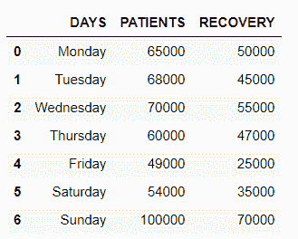

# 使用融化和取消融化重塑熊猫数据帧

> 原文:[https://www . geeksforgeeks . org/resuming-pandas-data frames-use-melt-and-unmelt/](https://www.geeksforgeeks.org/reshaping-pandas-dataframes-using-melt-and-unmelt/)

Pandas 是一个开源的、BSD 许可的库，用 Python 语言编写。熊猫提供高性能、快速、易于使用的数据结构和数据分析工具，用于处理数字数据和时间序列。熊猫是建立在 Numpy 库的基础上，用 Python、Cython 和 C 等语言编写的。2008 年，韦斯·麦金尼开发了熊猫库。在熊猫中，我们可以从各种文件格式中导入数据，如 JSON、SQL、微软 Excel 等。dataframes 功能用于加载数据和对数据进行操作。

有时我们需要重塑熊猫的数据框架，以更好的方式进行分析。重塑在数据分析中起着至关重要的作用。熊猫提供了像**融化**和**融化**这样的重塑功能。

## **熊猫.融化()**

[**melt()**](https://www.geeksforgeeks.org/python-pandas-melt/) 用于将较宽的数据帧转换为较长的形式。当需要将特定列视为标识符时，可以使用该函数。

> **语法:** pandas.melt(frame，id_vars=None，value_vars=None，var_name=None，value_name='value '，col_level=None)

**例 1:**

用关于“**天**”、“**患者**和“**康复**的数据初始化数据框。

## 蟒蛇 3

```
# importing pandas library
import pandas as pd

# creating and initializing a list
values = [['Monday', 65000, 50000],
          ['Tuesday', 68000, 45000],
          ['Wednesday', 70000, 55000],
          ['Thursday', 60000, 47000],
          ['Friday', 49000, 25000],
          ['Saturday', 54000, 35000],
          ['Sunday', 100000, 70000]]

# creating a pandas dataframe
df = pd.DataFrame(values, columns=['DAYS', 'PATIENTS', 'RECOVERY'])

# displaying the data frame
df
```

**输出:**



现在，我们在列**‘DAYS’**周围使用 **pandas.melt()** 重塑数据框。

## 蟒蛇 3

```
# melting with DAYS as column identifier
reshaped_df = df.melt(id_vars=['DAYS'])

# displaying the reshaped data frame
reshaped_df
```