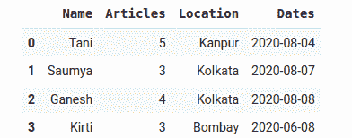

# 在两个日期之间选择熊猫数据框行

> 原文:[https://www . geesforgeks . org/select-pandas-data frame-row-inter-two-date/](https://www.geeksforgeeks.org/select-pandas-dataframe-rows-between-two-dates/)

**先决条件:**T2】熊猫

**熊猫** 是建立在 NumPy 库之上的开源库。它是一个 Python 包，提供了各种数据结构和操作来操作数字数据和时间序列。它主要是流行的，因为导入和分析数据容易得多。熊猫速度快，对用户来说具有高性能&生产力。

本文着重于获取两个日期之间的选定熊猫数据框行。我们可以通过使用过滤器来做到这一点。

日期最初可以用几种方式表示:

*   线
*   np.日期时间 64
*   datetime.datetime

为了操作熊猫中的日期，我们在熊猫中使用 pd.to_datetime()函数将不同的日期表示转换为 datetime64[ns]格式。

> ***语法:** pandas.to_datetime(arg，errors='raise '，dayfirst=False，yearfirst=False，utc=None，box=True，format=None，exact=True，unit=None，infer _ datetime _ format = False，origin='unix '，cache=False)*
> 
> ***参数:***
> 
> *   ***参数:**要转换为日期时间对象的整数、字符串、浮点、列表或字典对象。*
> *   ***第一天:**布尔值，如果为真，则将第一天置于第一位。*
> *   ***年第一:**布尔值，如果为真，则将年放在第一位。*
> *   ***世界协调时:**布尔值，如果为真，则返回以世界协调时为单位的时间。*
> *   ***格式:**字符串输入，告诉日、月、年的位置。*

### 方法

*   导入模块
*   创建或加载数据
*   创建数据框
*   将“日期”列转换为 datetime64[ns]数据类型
*   定义开始日期和结束日期。
*   使用过滤器显示并存储更新的数据帧。
*   显示数据框

**示例:**原始数据帧

## 蟒蛇 3

```
import pandas as pd
data = {'Name': ['Tani', 'Saumya',
                 'Ganesh', 'Kirti'],

        'Articles': [5, 3, 4, 3],

        'Location': ['Kanpur', 'Kolkata',
                     'Kolkata', 'Bombay'],
        'Dates': ['2020-08-04', '2020-08-07', '2020-08-08', '2020-06-08']}

# Create DataFrame
df = pd.DataFrame(data)
display(df)
```

**输出:**



**示例:**选择两行之间的数据帧行

## 蟒蛇 3

```
import pandas as pd
data = {'Name': ['Tani', 'Saumya',
                 'Ganesh', 'Kirti'],

        'Articles': [5, 3, 4, 3],

        'Location': ['Kanpur', 'Kolkata',
                     'Kolkata', 'Bombay'],
        'Dates': ['2020-08-04', '2020-08-07', '2020-08-08', '2020-06-08']}

# Create DataFrame
df = pd.DataFrame(data)
start_date = '2020-08-05'
end_date = '2020-08-08'
mask = (df['Dates'] > start_date) & (df['Dates'] <= end_date)

df = df.loc[mask]
display(df)
```

**输出:**

