# 使用[ ]，loc & iloc

在熊猫数据框中按名称或索引选择行&列

> 原文:[https://www . geesforgeks . org/select-row-columns-by-name-in-pandas-data frame-use-loc-iloc/](https://www.geeksforgeeks.org/select-rows-columns-by-name-or-index-in-pandas-dataframe-using-loc-iloc/)

熊猫索引意味着从数据框中选择数据的行和列。它可以是选择所有的行和特定数量的列、特定数量的行和所有的列或者每个特定数量的行和列。索引也称为**子集选择。**
让我们用元组列表创建一个简单的数据框，假设列名为:“姓名”、“年龄”、“城市”和“工资”。

```py
# import pandas
import pandas as pd

# List of Tuples
employees = [('Stuti', 28, 'Varanasi', 20000),
            ('Saumya', 32, 'Delhi', 25000),
            ('Aaditya', 25, 'Mumbai', 40000),
            ('Saumya', 32, 'Delhi', 35000),
            ('Saumya', 32, 'Delhi', 30000),
            ('Saumya', 32, 'Mumbai', 20000),
            ('Aaditya', 40, 'Dehradun', 24000),
            ('Seema', 32, 'Delhi', 70000)
            ]

# Create a DataFrame object from list 
df = pd.DataFrame(employees, 
                columns =['Name', 'Age', 
                         'City', 'Salary'])
# Show the dataframe
df
```

**输出:**
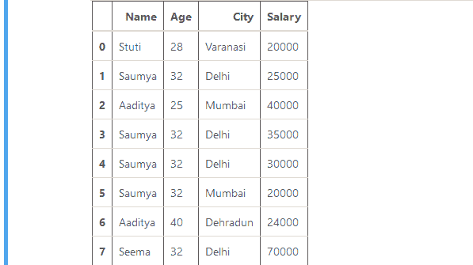

**方法 1:使用数据框。[ ].**
**【】**用于通过提及各自的列名来选择列。

**例 1 :** 选择单列。
T3】代号:

```py
# import pandas
import pandas as pd

# List of Tuples
employees = [('Stuti', 28, 'Varanasi', 20000),
            ('Saumya', 32, 'Delhi', 25000),
            ('Aaditya', 25, 'Mumbai', 40000),
            ('Saumya', 32, 'Delhi', 35000),
            ('Saumya', 32, 'Delhi', 30000),
            ('Saumya', 32, 'Mumbai', 20000),
            ('Aaditya', 40, 'Dehradun', 24000),
            ('Seema', 32, 'Delhi', 70000)
            ]

# Create a DataFrame object from list 
df = pd.DataFrame(employees, 
                columns =['Name', 'Age', 
                         'City', 'Salary'])

# Using the operator [] 
# to select a column
result = df["City"]

# Show the dataframe
result
```

**输出:**
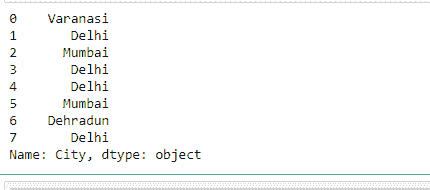

**例 2:** 选择多列。
T3】代号:

```py
# import pandas
import pandas as pd

# List of Tuples
employees = [('Stuti', 28, 'Varanasi', 20000),
            ('Saumya', 32, 'Delhi', 25000),
            ('Aaditya', 25, 'Mumbai', 40000),
            ('Saumya', 32, 'Delhi', 35000),
            ('Saumya', 32, 'Delhi', 30000),
            ('Saumya', 32, 'Mumbai', 20000),
            ('Aaditya', 40, 'Dehradun', 24000),
            ('Seema', 32, 'Delhi', 70000)
            ]

# Create a DataFrame object from list 
df = pd.DataFrame(employees, 
                columns =['Name', 'Age',
                        'City', 'Salary'])

# Using the operator [] to 
# select multiple columns
result = df[["Name", "Age", "Salary"]]

# Show the dataframe
result
```

**输出:**
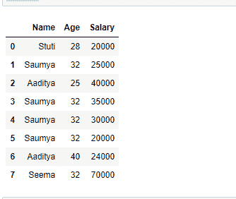

**方法 2:使用 Dataframe.loc[ ]。**
**。loc[]** 函数通过行或列的标签选择数据。它可以选择行和列的子集。有很多方法可以使用这个功能。
**例 1:** 选择单行。
**代码:**

```py
# import pandas
import pandas as pd

# List of Tuples
employees = [('Stuti', 28, 'Varanasi', 20000),
            ('Saumya', 32, 'Delhi', 25000),
            ('Aaditya', 25, 'Mumbai', 40000),
            ('Saumya', 32, 'Delhi', 35000),
            ('Saumya', 32, 'Delhi', 30000),
            ('Saumya', 32, 'Mumbai', 20000),
            ('Aaditya', 40, 'Dehradun', 24000),
            ('Seema', 32, 'Delhi', 70000)
            ]

# Create a DataFrame object from list 
df = pd.DataFrame(employees,
                 columns =['Name', 'Age',
                  'City', 'Salary'])

# Set 'Name' column as index 
# on a Dataframe
df.set_index("Name", inplace = True)

# Using the operator .loc[]
# to select single row
result = df.loc["Stuti"]

# Show the dataframe
result
```

**输出:**
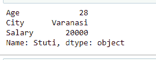

**示例 2:** 选择多行。
T3】代号:

```py
# import pandas
import pandas as pd

# List of Tuples
employees = [('Stuti', 28, 'Varanasi', 20000),
            ('Saumya', 32, 'Delhi', 25000),
            ('Aaditya', 25, 'Mumbai', 40000),
            ('Saumya', 32, 'Delhi', 35000),
            ('Saumya', 32, 'Delhi', 30000),
            ('Saumya', 32, 'Mumbai', 20000),
            ('Aaditya', 40, 'Dehradun', 24000),
            ('Seema', 32, 'Delhi', 70000)
            ]

# Create a DataFrame object from list 
df = pd.DataFrame(employees, 
                  columns =['Name', 'Age',
                   'City', 'Salary'])

# Set index on a Dataframe
df.set_index("Name", 
              inplace = True)

# Using the operator .loc[]
# to select multiple rows
result = df.loc[["Stuti", "Seema"]]

# Show the dataframe
result
```

**输出:**
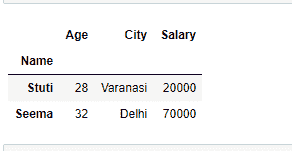

**示例 3:** 选择多行和特定列。

```py
Syntax:  Dataframe.loc[["row1", "row2"...], ["column1", "column2", "column3"...]]
```

**代码:**

```py
# import pandas
import pandas as pd

# List of Tuples
employees = [('Stuti', 28, 'Varanasi', 20000),
            ('Saumya', 32, 'Delhi', 25000),
            ('Aaditya', 25, 'Mumbai', 40000),
            ('Saumya', 32, 'Delhi', 35000),
            ('Saumya', 32, 'Delhi', 30000),
            ('Saumya', 32, 'Mumbai', 20000),
            ('Aaditya', 40, 'Dehradun', 24000),
            ('Seema', 32, 'Delhi', 70000)
            ]

# Create a DataFrame object from list 
df = pd.DataFrame(employees, 
                 columns =['Name', 'Age',
                  'City', 'Salary'])

# Set 'Name' column as index 
# on a Dataframe
df.set_index("Name", inplace = True)

# Using the operator .loc[] to 
# select multiple rows with some
# particular columns
result = df.loc[["Stuti", "Seema"],
               ["City", "Salary"]]

# Show the dataframe
result
```

**输出:**
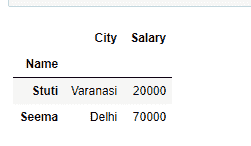

**示例 4:** 选择具有某些特定列的所有行。我们使用单冒号[ : ]来选择我们想要选择的所有行和列列表，如下所示:

```py
Syntax: Dataframe.loc[[:, ["column1", "column2", "column3"]]
```

**代码:**

```py
# import pandas
import pandas as pd

# List of Tuples
employees = [('Stuti', 28, 'Varanasi', 20000),
            ('Saumya', 32, 'Delhi', 25000),
            ('Aaditya', 25, 'Mumbai', 40000),
            ('Saumya', 32, 'Delhi', 35000),
            ('Saumya', 32, 'Delhi', 30000),
            ('Saumya', 32, 'Mumbai', 20000),
            ('Aaditya', 40, 'Dehradun', 24000),
            ('Seema', 32, 'Delhi', 70000)
            ]

# Creating a DataFrame object from list 
df = pd.DataFrame(employees,
                  columns =['Name', 'Age', 
                  'City', 'Salary'])

# Set 'Name' column as index 
# on a Dataframe
df.set_index("Name", inplace = True)

# Using the operator .loc[] to
# select all the rows with 
# some particular columns
result = df.loc[:, ["City", "Salary"]]

# Show the dataframe
result
```

**输出:**
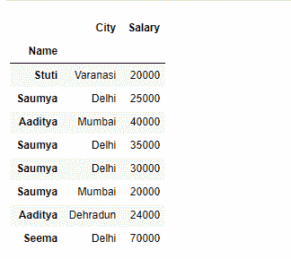

**方法 3:使用 Dataframe.iloc[ ]。**
**iloc【】**用于基于位置的选择。它类似于 loc[]索引器，但只需要整数值来进行选择。
**例 1 :** 选择单行。
**代码:**

```py
# import pandas
import pandas as pd

# List of Tuples
employees = [('Stuti', 28, 'Varanasi', 20000),
            ('Saumya', 32, 'Delhi', 25000),
            ('Aaditya', 25, 'Mumbai', 40000),
            ('Saumya', 32, 'Delhi', 35000),
            ('Saumya', 32, 'Delhi', 30000),
            ('Saumya', 32, 'Mumbai', 20000),
            ('Aaditya', 40, 'Dehradun', 24000),
            ('Seema', 32, 'Delhi', 70000)
            ]

# Create a DataFrame object from list 
df = pd.DataFrame(employees, 
                  columns =['Name', 'Age',
                   'City', 'Salary'])

# Using the operator .iloc[]
# to select single row
result = df.iloc[2]

# Show the dataframe
result
```

**输出:**
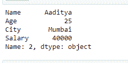

**示例 2:** 选择多行。
T3】代号:

```py
# import pandas
import pandas as pd

# List of Tuples
employees = [('Stuti', 28, 'Varanasi', 20000),
            ('Saumya', 32, 'Delhi', 25000),
            ('Aaditya', 25, 'Mumbai', 40000),
            ('Saumya', 32, 'Delhi', 35000),
            ('Saumya', 32, 'Delhi', 30000),
            ('Saumya', 32, 'Mumbai', 20000),
            ('Aaditya', 40, 'Dehradun', 24000),
            ('Seema', 32, 'Delhi', 70000)
            ]

# Create a DataFrame object from list 
df = pd.DataFrame(employees, 
                columns =['Name', 'Age',
                'City', 'Salary'])

# Using the operator .iloc[] 
# to select multiple rows
result = df.iloc[[2, 3, 5]]

# Show the dataframe
result
```

**输出:**
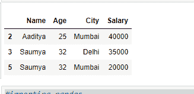

**示例 3:** 选择具有某些特定列的多行。
T3】代号:

```py
# import pandas
import pandas as pd

# List of Tuples
employees = [('Stuti', 28, 'Varanasi', 20000),
            ('Saumya', 32, 'Delhi', 25000),
            ('Aaditya', 25, 'Mumbai', 40000),
            ('Saumya', 32, 'Delhi', 35000),
            ('Saumya', 32, 'Delhi', 30000),
            ('Saumya', 32, 'Mumbai', 20000),
            ('Aaditya', 40, 'Dehradun', 24000),
            ('Seema', 32, 'Delhi', 70000)
            ]

# Creating a DataFrame object from list 
df = pd.DataFrame(employees,
                  columns =['Name', 'Age',
                  'City', 'Salary'])

# Using the operator .iloc[] 
# to select multiple rows with
# some particular columns
result = df.iloc[[2, 3, 5],
                  [0, 1]]

# Show the dataframe
result
```

**输出:**
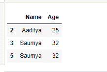

**示例 4:** 选择具有某些特定列的所有行。
T3】代号:

```py
# import pandas
import pandas as pd

# List of Tuples
employees = [('Stuti', 28, 'Varanasi', 20000),
            ('Saumya', 32, 'Delhi', 25000),
            ('Aaditya', 25, 'Mumbai', 40000),
            ('Saumya', 32, 'Delhi', 35000),
            ('Saumya', 32, 'Delhi', 30000),
            ('Saumya', 32, 'Mumbai', 20000),
            ('Aaditya', 40, 'Dehradun', 24000),
            ('Seema', 32, 'Delhi', 70000)
            ]

# Create a DataFrame object from list 
df = pd.DataFrame(employees, 
                columns =['Name', 'Age', 
               'City', 'Salary'])

# Using the operator .iloc[]
# to select all the rows with
# some particular columns
result = df.iloc[:, [0, 1]]

# Show the dataframe
result
```

**输出:**
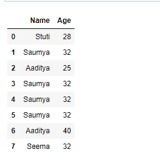