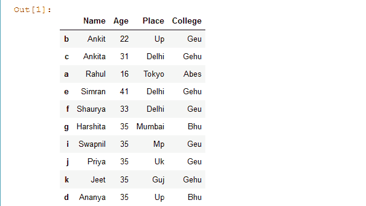
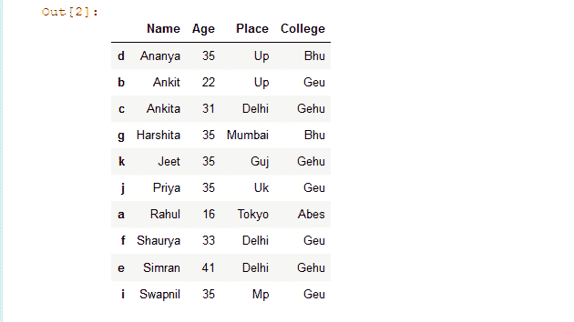
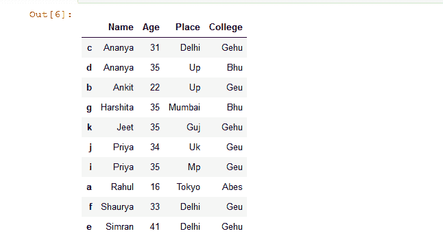
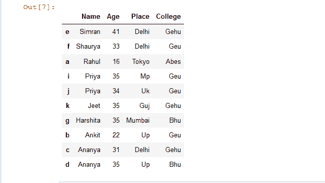
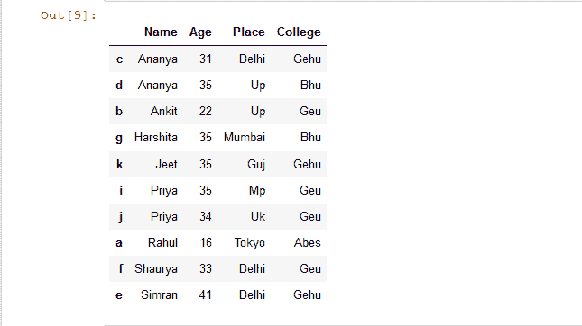
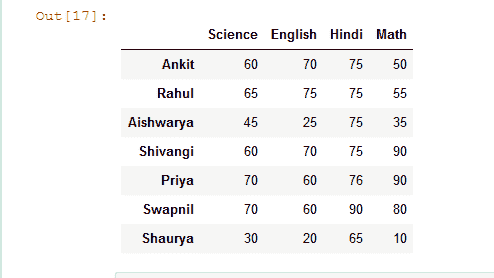
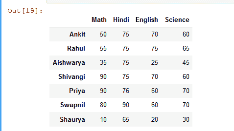
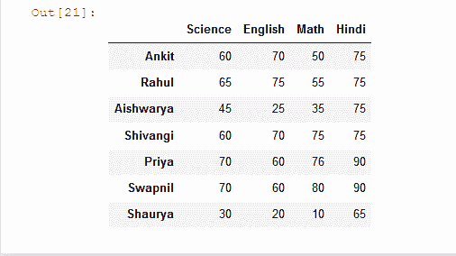

# 根据值对熊猫数据框中的行或列进行排序

> 原文:[https://www . geesforgeks . org/sort-熊猫中的行或列-data frame-基于值/](https://www.geeksforgeeks.org/sort-rows-or-columns-in-pandas-dataframe-based-on-values/)

在本文中，让我们讨论如何根据值对熊猫数据框中的行或列进行排序。Pandas `sort_values()` 方法按照传递列的升序或降序对数据帧进行排序。它不同于排序的 Python 函数，因为它不能对数据框进行排序，也不能选择特定的列。

> **语法:** DataFrame.sort_values(by，axis=0，升序=True，inplace=False，kind='quicksort '，na_position='last ')
> 
> **参数:**此方法将采用以下参数:
> **by:** 单个/列名列表对数据框进行排序。
> **轴:**行为 0 或“索引”，列为 1 或“列”。
> **升序:**布尔值，如果为真，则按升序对数据框进行排序。
> **在位:**布尔值。如果为真，则对传递的数据框本身进行更改。
> **种类:**可以有三个输入(“quicksort”、“mergesort”或“heapsort”)的用于对数据帧进行排序的算法的字符串。
> **na_position:** 取两个字符串输入‘last’或‘first’来设置 Null 值的位置。默认值为“最后”。
> 
> **返回类型:**返回与函数调用方数据框具有相同维度的排序数据框。

现在，让我们创建一个示例数据帧:

```py
# import pandas library as pd
import pandas as pd

# List of Tuples
students = [('Ankit', 22, 'Up', 'Geu'),
           ('Ankita', 31, 'Delhi', 'Gehu'),
           ('Rahul', 16, 'Tokyo', 'Abes'),
           ('Simran', 41, 'Delhi', 'Gehu'),
           ('Shaurya', 33, 'Delhi', 'Geu'),
           ('Harshita', 35, 'Mumbai', 'Bhu' ),
           ('Swapnil', 35, 'Mp', 'Geu'),
           ('Priya', 35, 'Uk', 'Geu'),
           ('Jeet', 35, 'Guj', 'Gehu'),
           ('Ananya', 35, 'Up', 'Bhu')
            ]

# Create a DataFrame object from
# list of tuples with columns
# and indices.
details = pd.DataFrame(students, columns =['Name', 'Age', 
                                           'Place', 'College'],
                        index =[ 'b', 'c', 'a', 'e', 'f',
                                'g', 'i', 'j', 'k', 'd'])
# show the dataframe
details
```

**输出:**


**示例 1:** 基于单个列对数据框行进行排序。

```py
# import pandas library as pd
import pandas as pd

# List of Tuples
students = [('Ankit', 22, 'Up', 'Geu'),
           ('Ankita', 31, 'Delhi', 'Gehu'),
           ('Rahul', 16, 'Tokyo', 'Abes'),
           ('Simran', 41, 'Delhi', 'Gehu'),
           ('Shaurya', 33, 'Delhi', 'Geu'),
           ('Harshita', 35, 'Mumbai', 'Bhu' ),
           ('Swapnil', 35, 'Mp', 'Geu'),
           ('Priya', 35, 'Uk', 'Geu'),
           ('Jeet', 35, 'Guj', 'Gehu'),
           ('Ananya', 35, 'Up', 'Bhu')
            ]

# Create a DataFrame object from
# list of tuples with columns
# and indices.
details = pd.DataFrame(students, columns =['Name', 'Age',
                                           'Place', 'College'],
                        index =[ 'b', 'c', 'a', 'e', 'f',
                                'g', 'i', 'j', 'k', 'd'])

# Sort the rows of dataframe by 'Name' column
rslt_df = details.sort_values(by = 'Name')

# show the resultant Dataframe
rslt_df
```

**输出:**


**示例 2:** 基于多列对数据框行进行排序。

```py
# import pandas library as pd
import pandas as pd

# List of Tuples
students = [('Ankit', 22, 'Up', 'Geu'),
           ('Ananya', 31, 'Delhi', 'Gehu'),
           ('Rahul', 16, 'Tokyo', 'Abes'),
           ('Simran', 41, 'Delhi', 'Gehu'),
           ('Shaurya', 33, 'Delhi', 'Geu'),
           ('Harshita', 35, 'Mumbai', 'Bhu' ),
           ('Priya', 35, 'Mp', 'Geu'),
           ('Priya', 34, 'Uk', 'Geu'),
           ('Jeet', 35, 'Guj', 'Gehu'),
           ('Ananya', 35, 'Up', 'Bhu')
            ]

# Create a DataFrame object from
# list of tuples with columns
# and indices.
details = pd.DataFrame(students, columns =['Name', 'Age', 
                                           'Place', 'College'],
                        index =[ 'b', 'c', 'a', 'e', 'f',
                                'g', 'i', 'j', 'k', 'd'])

# sort Dataframe rows based on a 'Name' & 'Age' columns

# if duplicate value is present in 'Name' column
# then sorting will be done according to 'Age' column
rslt_df = details.sort_values(by = ['Name', 'Age'])

# show the resultant Dataframe
rslt_df
```

**输出:**


**示例 3:** 按降序对基于列的数据框行进行排序。

```py
# import pandas library as pd
import pandas as pd

# List of Tuples
students = [('Ankit', 22, 'Up', 'Geu'),
           ('Ananya', 31, 'Delhi', 'Gehu'),
           ('Rahul', 16, 'Tokyo', 'Abes'),
           ('Simran', 41, 'Delhi', 'Gehu'),
           ('Shaurya', 33, 'Delhi', 'Geu'),
           ('Harshita', 35, 'Mumbai', 'Bhu' ),
           ('Priya', 35, 'Mp', 'Geu'),
           ('Priya', 34, 'Uk', 'Geu'),
           ('Jeet', 35, 'Guj', 'Gehu'),
           ('Ananya', 35, 'Up', 'Bhu')
            ]

# Create a DataFrame object from
# list of tuples with columns
# and indices.
details = pd.DataFrame(students, columns =['Name', 'Age',
                                           'Place', 'College'],
                        index =[ 'b', 'c', 'a', 'e', 'f', 
                                'g', 'i', 'j', 'k', 'd'])

# sort Dataframe rows based on "Name' 
# column in Descending Order
rslt_df = details.sort_values(by = 'Name', ascending = False)

# show the resultant Dataframe
rslt_df
```

**输出:**


**示例 4:** 基于原地列对数据框行进行排序。

```py
# import pandas library as pd
import pandas as pd

# List of Tuples
students = [('Ankit', 22, 'Up', 'Geu'),
           ('Ananya', 31, 'Delhi', 'Gehu'),
           ('Rahul', 16, 'Tokyo', 'Abes'),
           ('Simran', 41, 'Delhi', 'Gehu'),
           ('Shaurya', 33, 'Delhi', 'Geu'),
           ('Harshita', 35, 'Mumbai', 'Bhu' ),
           ('Priya', 35, 'Mp', 'Geu'),
           ('Priya', 34, 'Uk', 'Geu'),
           ('Jeet', 35, 'Guj', 'Gehu'),
           ('Ananya', 35, 'Up', 'Bhu')
            ]

# Create a DataFrame object from
# list of tuples with columns
# and indices.
details = pd.DataFrame(students, columns =['Name', 'Age',
                                           'Place', 'College'],
                        index =[ 'b', 'c', 'a', 'e', 'f',
                                'g', 'i', 'j', 'k', 'd'])

# Sort the rows of dataframe by  'Name' 
# column inplace
details.sort_values(by = 'Name', inplace = True)

# show the resultant Dataframe
details
```

**输出:**


**让我们看看另一个简单的数据框架，在这个框架上，我们可以根据行对列进行排序。**

```py
# import pandas library as pd
import pandas as pd

# List of Tuples
students = [
           (75, 50, 60, 70),
           (75, 55, 65, 75),
           (75, 35, 45, 25),
           (75, 90, 60, 70),
           (76, 90, 70, 60),
           (90, 80, 70, 60),
           (65, 10, 30, 20)
            ]

# Create a DataFrame object from
# list of tuples with columns
# and indices.
details = pd.DataFrame(students, columns =['Hindi', 'Math', 
                                           'Science', 'English'],
                        index = ['Ankit', 'Rahul', 'Aishwarya', 
                                 'Shivangi', 'Priya', 'Swapnil',
                                 'Shaurya'])
# show the dataframe
details
```

**输出:**


**示例 1:** 基于单行对数据框的列进行排序。

```py
# import pandas library as pd
import pandas as pd

# List of Tuples
students = [
           (75, 50, 60, 70),
           (75, 55, 65, 75),
           (75, 35, 45, 25),
           (75, 90, 60, 70),
           (76, 90, 70, 60),
           (90, 80, 70, 60),
           (65, 10, 30, 20)
            ]

# Create a DataFrame object from
# list of tuples with columns
# and indices.
details = pd.DataFrame(students, columns =['Hindi', 'Math', 
                                           'Science', 'English'],
                        index = ['Ankit', 'Rahul', 'Aishwarya', 
                                 'Shivangi', 'Priya', 'Swapnil',
                                 'Shaurya'])

# sort columns of a Dataframe based 
# on a 'Shivangi' row
rslt_df = details.sort_values(by = 'Shivangi', axis = 1)

# show the dataframe
rslt_df
```

**输出:**


**示例 2:** 根据单行按降序对数据框的列进行排序。

```py
# import pandas library as pd
import pandas as pd

# List of Tuples
students = [
           (75, 50, 60, 70),
           (75, 55, 65, 75),
           (75, 35, 45, 25),
           (75, 90, 60, 70),
           (76, 90, 70, 60),
           (90, 80, 70, 60),
           (65, 10, 30, 20)
            ]

# Create a DataFrame object from
# list of tuples with columns
# and indices.
details = pd.DataFrame(students, columns =['Hindi', 'Math', 
                                           'Science', 'English'],
                        index = ['Ankit', 'Rahul', 'Aishwarya', 
                                 'Shivangi', 'Priya', 'Swapnil',
                                 'Shaurya'])

# Sort columns of a dataframe in descending order 
# based on a 'Shivangi' row 
rslt_df = details.sort_values(by = 'Shivangi', axis = 1, ascending = False)

rslt_df
```

**输出:**


**示例 3:** 基于多行对数据框的列进行排序。

```py
# import pandas library as pd
import pandas as pd

# List of Tuples
students = [
           (75, 50, 60, 70),
           (75, 55, 65, 75),
           (75, 35, 45, 25),
           (75, 90, 60, 70),
           (76, 90, 70, 60),
           (90, 80, 70, 60),
           (65, 10, 30, 20)
            ]

# Create a DataFrame object from
# list of tuples with columns
# and indices.
details = pd.DataFrame(students, columns =['Hindi', 'Math', 
                                           'Science', 'English'],
                        index = ['Ankit', 'Rahul', 'Aishwarya', 
                                 'Shivangi', 'Priya', 'Swapnil',
                                 'Shaurya'])

# sort Dataframe columns based on a 'Shivangi' & 'Priya' rows

# if duplicate value is present in 'Shivangi'  row
# then sorting will be done according to 'Priya' row
rslt_df = details.sort_values(by = ['Shivangi', 'Priya'], axis = 1)

rslt_df
```

**输出:**

